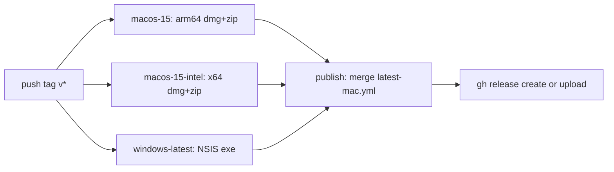
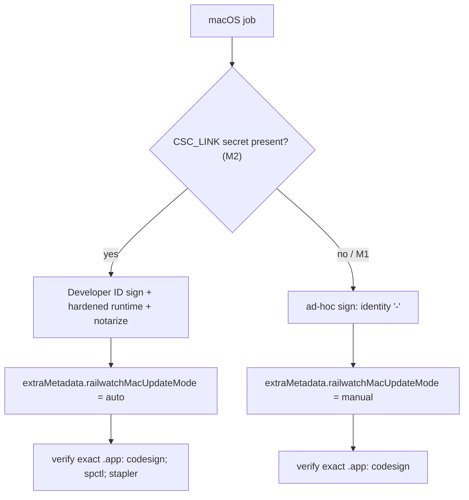

# macOS 安装包发布：实施方案

| 项目 | 内容 |
| --- | --- |
| 目标版本 | **M1 = v0.6.0**：ad-hoc 免签安装包 + 手动更新；**M2 = 后续版本**：Developer ID 签名 + 公证 + 应用内自动更新 |
| 基线代码 | v0.5.5（`fbabd20`）；实施前若基线前移，重新核对 2.1 的阻塞点 |
| 状态 | M1 代码已实施（见附录 C），待 macOS CI 首次运行与 8.1 真机验收；M2 未开始 |
| 修订日期 | 2026-10-04 |
| 依赖核对基线 | `electron-updater` 6.8.9、`electron-builder` 26.15.0、Electron 39、`keyring` 25.6.0；升级依赖时重新验证更新事件顺序、钥匙串行为与签名流程 |
| 签名策略 | M1 只实现 ad-hoc 签名；M2 增加 Developer ID 签名 + 公证，由仓库 Secrets 切换 |
| 目标架构 | Apple Silicon（arm64）与 Intel（x64）各出一个 DMG，原生构建，不做 Universal 包 |
| 最低系统 | macOS 12 Monterey（Electron 39 的最低要求） |

**阅读约定**

- 代码位置用“文件 + 函数 / 符号”标注，不写行号（行号随版本漂移）。第三方库按锁定版本引用，可附行号。
- 章节编号指本文章节（如 4.1），**S** 前缀指第 5 节中的实施阶段（如 S1.4 = 阶段 1 第 4 项）。
- 标注 **M2** 的内容不属于 v0.6.0 范围。

## 1. 一句话定义

在现有 Windows 安装包之外，让每次推送 `v*` 标签时 GitHub Release 同时出现 `RailWatch-12306-<版本>-arm64.dmg` 和 `RailWatch-12306-<版本>-x64.dmg`：Mac 用户下载、拖入“应用程序”即可使用，内置 Python 运行时，不需要另装 Python 或 Node.js；Windows 安装包与更新链路保持不变。

## 2. 现状：为什么现在只有 exe

### 2.1 阻塞点清单

下表是按 v0.5.5 代码逐项核对得到的 Windows 专用写法。B1–B3 任何一项不改，macOS 包要么打不出来，要么打出来也无法启动运行时。

| # | 问题 | 位置 | 在 macOS 上的后果 | 解决 |
| --- | --- | --- | --- | --- |
| B1 | 只配置了 `win` / `nsis` 目标 | `electron-builder.yml` | 无法生成 dmg / zip | S3.1 |
| B2 | 打包后的运行时路径写死为 `railwatch_runtime.exe` | `electron/pythonRuntime.ts` `createPythonRuntimeCommand` | 找不到文件，退回调用系统 `python railwatch_runtime.py`；打包应用里没有源码，运行时直接启动失败（最大阻塞） | S2.1 |
| B3 | 只有 Windows 打包工作流，且自己创建 Release | `.github/workflows/package-windows.yml` | 没有 macOS 构建；若另加一个 macOS 工作流，两者会抢着创建同一个 Release | S5 |
| B4 | 运行时 spec 偏向 Windows：隐式导入 `win32crypt`、可选打入 `chromedriver.exe`、onefile 单文件模式 | `RailWatch_runtime.spec` 的 `hiddenimports`、可选数据文件循环、`EXE(...)` | `win32crypt` 只产生警告；onefile 在 macOS 上每次启动都要解压到临时目录，且嵌入的动态库在强化运行时 + 公证下容易出问题 | S1.1 |
| B5 | ChromeDriver 文件名写死为 `chromedriver.exe` | `railwatch_bridge.py` 的 `PACKAGED_CHROMEDRIVER_PATH` / `DEFAULT_CHROMEDRIVER_PATH` 及 `clear_local_data` 中的驱动路径重置；`anti_detect.py` `create_driver` | `chromedriver_manager.py` 在 macOS 上下载的是 `chromedriver`，重启后路径对不上，界面显示“未找到 ChromeDriver”，每次启动重复下载 | S1.2 |
| B6 | 非 Windows 直接明文保存通知凭据 | `railwatch_preferences.py` `protect_local_secret` / `unprotect_local_secret` | 邮箱授权码等以明文写入 `notification_settings.json`；`tests/runtime_order_smoke.py` 断言文件含 `dpapi:`，在 macOS 上必然失败 | S1.4 |
| B7 | 托盘和窗口图标使用 `icon.ico` | `electron/main.ts` `ensureTray`、`createWindow` | macOS 的 `nativeImage` 不支持 ico，托盘图标为空；开启“关闭到托盘”后窗口隐藏但看不到托盘图标（只能点 Dock 图标找回） | S2.2 |
| B8 | `Menu.setApplicationMenu(null)` | `electron/main.ts` `createWindow` | macOS 的复制、粘贴、全选、退出快捷键都依赖应用菜单，去掉后 Cmd+C / Cmd+V / Cmd+Q 全部失效，乘客姓名等输入框无法粘贴 | S2.3 |
| B9 | 非 Windows 使用 `autoUpdater` 且 `autoDownload = true` | `electron/main.ts` `initializeAutoUpdater` | 未签名应用下载更新时 Squirrel.Mac 校验签名必然失败，界面反复报错 | S4.1、S4.2 |
| B10 | 安装更新只认 `launchInstaller` | `electron/updateManager.ts` `installUpdate`；只有 `electron/nsisUpdater.ts` 实现了它 | macOS 上点击“立即重启安装”只会得到“当前平台不支持自动安装” | M1：手动模式不提供安装（S4.3）；M2：S4.4 |
| B11 | 强制退出只结束直接子进程 | `electron/pythonRuntime.ts` `forceStop` | 非 Windows 分支只 `SIGKILL` Python 进程，它拉起的 chromedriver / Chrome 可能残留 | S2.4 |
| B12 | 测试和脚本按 Windows 写死 | `electron/__tests__/packageWindowsWorkflow.test.ts`；`tests/runtime_order_smoke.py`（默认 `dist-runtime/railwatch_runtime.exe`、改写 `LOCALAPPDATA`、`dpapi:` 断言）；`tests/packaged_smoke.py`（默认 `win-unpacked`、`STARTUPINFO`、`taskkill`） | 改工作流后测试失败；冒烟脚本无法在 macOS runner 上运行 | S6.1 |
| B13 | 文档只写 Windows | `README.md`“下载安装”一节只写 exe，并注明“macOS / Linux 暂无安装包”；`docs/RELEASE_CHECKLIST.md` | 用户不知道有 Mac 版，也不知道如何放行未签名应用 | S6.2 |

### 2.2 已经可以直接复用的部分

| 能力 | 现有实现 |
| --- | --- |
| macOS 上检测 Chrome 版本 | `chromedriver_manager.py` `_detect_chrome_macos` |
| 下载对应架构的 ChromeDriver | `_cft_platform_name` 返回 `mac-arm64` / `mac-x64`；`download_and_install_chromedriver` 下载后 `chmod 0o755` |
| 数据目录 | `railwatch_bridge.py` `get_data_path` 在 macOS 上使用 `~/Library/Application Support/railwatch-12306` |
| 订单续接锁 | `railwatch_orders.py` `_try_resume_lease` 已有 `fcntl.flock` 分支 |
| 残留受控 Chrome 清理 | `railwatch_bridge.py` `_terminate_profile_chrome` 非 Windows 分支使用 `pkill -f --user-data-dir=...` |
| 防休眠、Dock 激活 | `powerSaveBlocker`、`app.on("activate")` 已跨平台 |
| 应用图标 | `assets/images/icon.png` 为 512x512，electron-builder 可直接生成 icns |
| 浏览器指纹 | 启动 Chrome 时不伪造 UA / 屏幕 / WebGL（`railwatch_bridge.py` `_ensure_driver` 调用 `anti_detect.apply_chrome_launch_hardening`），Mac 上不存在“UA 写着 Windows、平台却是 Mac”的不一致 |
| 外链白名单 | `electron/ipcSecurity.ts` `isAllowedExternalUrl` 允许 `github.com`，可直接打开 Release 页 |
| 更新检查的平台扩展名 | `electron/updateChecker.ts` `PLATFORM_EXTENSIONS.darwin = [".dmg", ".zip"]` |
| 运行时随 stdin 关闭退出 | `railwatch_runtime.py` `main()` 在 stdin 结束后执行 `runtime.shutdown()`，Electron 退出后运行时不会长期残留 |

## 3. 范围、前置条件与目标资产

### 3.1 里程碑划分

| 里程碑 | 内容 | 不包含 |
| --- | --- | --- |
| **M1（v0.6.0）** | S1 全部；S2.1–S2.4；S3（ad-hoc）；S4.1–S4.3（手动更新、缺失平台提示）；S5（ad-hoc 构建与三种发布路径）；S6；8.1 验收 | 签名、公证、应用内自动安装；`stopAndWait`；`finishExit` / `installUpdate` 接口改造 |
| **M2（后续版本）** | S2.5 `stopAndWait`；S4.4–S4.5 签名安装与退出目的；S5 签名分支；S3.4 `--sign`；第 7 节 Secrets；8.2 签名升级专项 | — |

拆分理由：签名安装（S4.4–S4.5）是整份方案中最复杂、风险最高的部分，只有签名模式需要，且依赖尚未具备的开发者账号才能验收；它还要改动 Windows 共用的安装路径（`finishExit`、`installUpdate` 返回值）。M1 不触碰这些接口，Windows NSIS 安装与更新链路的回归面只剩发布编排和 `installMode` 字段。

M1 用户每次升级都需手动下载 DMG。从 ad-hoc 切换到签名模式后，已安装 ad-hoc 版本的用户需要手动安装一次签名版，之后才能自动更新（Squirrel.Mac 要求新旧版本签名身份一致）。

### 3.2 前置条件与资源

| 资源 | 用途 | 需要于 | 状态 |
| --- | --- | --- | --- |
| Apple Silicon Mac（非构建机） | arm64 真机验收 | M1 | 待确认 |
| Intel Mac（非构建机） | x64 真机验收 | M1 | 待确认 |
| macOS 12 环境（可与上面任一台合并） | 最低系统覆盖 | M1 | 待确认 |
| Apple Developer Program 账号（Developer ID Application 证书 + 公证凭据） | 签名与公证 | M2 | 待确认 |
| 隔离的测试发布源（测试仓库或测试 Release） | 签名升级专项，不用正式 Release 测试失败更新 | M2 | 待确认 |
| 负责人 | 实施与验收签字 | M1 | 待指定 |

第 6 节的工作量估算不含上述资源的准备与等待时间。

### 3.3 目标 Release 资产

| 平台 | 资产 | 用途 |
| --- | --- | --- |
| Windows（不变） | `RailWatch-12306-<ver>-x64.exe`、`.exe.blockmap`、`latest.yml` | 安装与 NSIS 自动更新 |
| macOS Apple Silicon | `RailWatch-12306-<ver>-arm64.dmg`、`RailWatch-12306-<ver>-arm64.zip` 及各自 `.blockmap` | DMG 供用户安装；zip 供 M2 自动更新 |
| macOS Intel | `RailWatch-12306-<ver>-x64.dmg`、`RailWatch-12306-<ver>-x64.zip` 及各自 `.blockmap` | 同上 |
| macOS 更新元数据 | `latest-mac.yml`（合并两个架构） | electron-updater 检查更新；按文件名中的 `arm64` 区分架构 |

M1 同样发布 zip 与 `latest-mac.yml`：手动模式检查更新依赖该元数据，M2 也无需再改资产格式。命名使用与 `win.artifactName` 相同的模式 `RailWatch-12306-${version}-${arch}.${ext}`（S3.1 在 mac / dmg 段设置），`electron/__tests__/updatePublishingConfig.test.ts` 的现有断言无需改动。

## 4. 总体方案

### 4.1 CI 流程



- 三个构建 job 只负责构建、校验并上传 Actions artifact，**不直接碰 Release**。
- 唯一的 `publish` job 下载本次运行所选平台的发布 artifact；包含 macOS 时合并 `latest-mac.yml`，校验所选平台元数据引用的文件全部存在，再创建或更新 Release（有 `docs/releases/<tag>.md` 就作为说明）。完整发布要求三个构建全部成功；单平台补发允许未选择的 job 为 `skipped`，但不允许所选 job 失败或取消（条件见 S5.1）。
- 同一标签的发布工作流串行执行；单平台补发必须检出该标签对应的提交并校验版本，只上传所选平台的资产和更新元数据，保留 Release 上另一平台已有资产。

**单平台发布的客户端副作用**（本文其他位置只引用此处）：electron-updater 只从最新正式 Release 读取更新元数据（`GitHubProvider.getLatestTagName` 请求 `releases/latest`）。若最新 Release 只有 Windows 资产，macOS 客户端检查更新时找不到 `latest-mac.yml`（反之亦然），抛出 `ERR_UPDATER_CHANNEL_FILE_NOT_FOUND`（electron-updater 6.8.9 `out/providers/GitHubProvider.js` 第 125 行）。对应措施：

1. 客户端把该错误显示为“最新版本暂未提供本平台安装包”，见 S4.3。
2. 发布时按规则设置“最新”标记，并在作业摘要中提示，见 S5.1 publish 第 6 步。
3. 发布方尽快补齐另一平台资产。

### 4.2 签名双模式

M1 只实现 ad-hoc 分支；签名分支属于 M2。



| 模式 | 用户首次打开 | 应用内更新 |
| --- | --- | --- |
| ad-hoc（M1，零成本） | Gatekeeper 提示“无法验证开发者”，需要在“系统设置 → 隐私与安全性”点“仍要打开”（macOS 15 起右键“打开”已不能绕过） | 只检查更新，主按钮改为“前往下载”，打开对应 Release 页手动下载 DMG |
| Developer ID 签名 + 公证（M2） | 直接打开 | MacUpdater 后台下载 zip，用户点“立即重启安装”后完成替换并重启 |

Apple Silicon 要求每个 Mach-O 至少带 ad-hoc 签名，否则会提示“已损坏”。因此免签模式也必须显式 ad-hoc 签名，而不是跳过签名。

### 4.3 为什么分架构而不是 Universal

Python 运行时由 PyInstaller 按构建机架构编译，Universal 包需要 universal2 版 Python 以及所有带 C 扩展依赖的 universal2 wheel，并让 `@electron/universal` 合并两份 PyInstaller 产物，复杂且易碎。两个原生 runner 各自构建最简单可靠，代价是用户需要选对芯片（README 写明：“苹果菜单 → 关于本机 → 芯片”显示 Apple M 系列选 arm64，显示 Intel 选 x64）。

## 5. 分阶段实施

### S1：Python 运行时跨平台（M1）

**S1.1 `RailWatch_runtime.spec` 按平台分支**

- `hiddenimports`：`win32crypt` 只在 `sys.platform == "win32"` 时加入；macOS 加入 `keyring.backends.macOS`（见 S1.4）。
- 可选数据文件：只在 Windows 打入 `chromedriver.exe`；macOS 不内置驱动，首次检查环境时由 `chromedriver_manager` 下载到数据目录。
- macOS 改为 onedir：`EXE(..., exclude_binaries=True)` + `COLLECT(..., name="railwatch_runtime")`，`upx=False`（UPX 会破坏 Mach-O 签名）。产物为 `dist-runtime/railwatch_runtime/railwatch_runtime` 加 `_internal/`。Windows 保持 onefile 不变，`dist-runtime/railwatch_runtime.exe` 路径不变。
- 保留现有“selenium 懒加载子模块缺失则构建失败”的检查。

选择 onedir 的理由：启动不需要每次解压（运行时就绪探测 `getRuntimeInfo` 的超时是 30 秒），每个动态库都是独立文件，可由 electron-builder 在组装 `.app` 后逐个签名。是否满足公证与运行要求，以最终 `.app` 的签名校验、运行时冒烟和真机验收为准。若嵌套签名出现问题，先定位具体二进制、权限和签名顺序；onefile 仅为待验证的备选，不是已具备的发布回退（边界见第 9 节）。

**S1.2 ChromeDriver 文件名**

在 `railwatch_bridge.py` 顶部新增：

```python
CHROMEDRIVER_NAME = "chromedriver.exe" if sys.platform == "win32" else "chromedriver"
```

替换 `PACKAGED_CHROMEDRIVER_PATH`、`DEFAULT_CHROMEDRIVER_PATH` 以及 `clear_local_data` 中重置 `self.chromedriver_path` 处的 `"chromedriver.exe"`；`anti_detect.py` `create_driver` 中的本地驱动默认路径同样按平台取名。`railwatch_cleanup.py` `release_orphan_browsers` 中的 `chromedriver.exe` 仅用于 Windows 分支，保持不变。

**S1.3 Chrome 检测补充用户级安装路径**

`chromedriver_manager._detect_chrome_macos` 增加 `~/Applications/Google Chrome.app/Contents/MacOS/Google Chrome`，覆盖没有管理员权限、把 Chrome 装在用户目录的情况。

**S1.4 macOS 凭据存入系统钥匙串**

存储设计：

- `requirements.txt` 与 `pyproject.toml` 新增 `keyring>=25; sys_platform=='darwin'`。
- 三个机密字段（`railwatch_bridge.NOTIFICATION_SECRET_FIELDS`：`server_chan_key`、`email_password`、`wecom_webhook_url`）在 macOS 上合并为钥匙串中的**单个**通用密码条目：service `org.railwatch.railwatch12306`，account `notification-secrets`，值为 JSON。`notification_settings.json` 中已配置的字段只写 `keychain:<字段名>` 标记。理由：ad-hoc 每次升级后，每个钥匙串条目的访问控制都要重新授权；单条目把授权框从最多 3 次降为 1 次。
- `railwatch_preferences` 新增 macOS 凭据存储（读全部 / 写全部 / 删除）；`protect_local_secret(value, slot)` / `unprotect_local_secret(value, slot)` 增加 `slot` 参数（取值为上述字段名）：
  - Windows：行为不变，仍为 `dpapi:` + base64，忽略 `slot`。
  - macOS：`protect` 返回 `keychain:<slot>` 标记，实际值由保存流程一次性写入钥匙串条目；`unprotect` 遇到 `keychain:` 标记时只校验、不读取钥匙串（读取只由下文的后台任务通过 `MacSecretStore` 完成），遇到 `dpapi:` 前缀直接拒绝。钥匙串不可用时抛出 `RuntimeError`，**不降级为明文**（与 Windows 的现有原则一致）。
  - 其他平台：保持现状。
- `_load_notification_settings` 中的 `legacy_plaintext` 判断（目前仅 `os.name == "nt"`）扩展到 macOS；迁移写入放到下述后台任务中执行，构造期不访问钥匙串。
- `clearLocalData` 成功清除文件后删除该钥匙串条目（授权约束见下文）。
- 同步更新 `tests/test_railwatch_preferences.py`、`tests/test_m0_contracts.py`、`tests/test_railwatch_bridge.py` 中对这两个函数的 patch 签名，并新增 darwin 分支的单元测试（mock `keyring`）。

**钥匙串访问不得放在运行时启动路径或命令线程上**

`railwatch_runtime.py` 在 `RailWatchRuntime.__init__` 中构造 `RailWatchBridge`，此时 `main()` 尚未开始读取 stdin 命令；而 `RailWatchBridge.__init__` 会调用 `_load_notification_settings()` 解密凭据。若 macOS 在这里同步读钥匙串：ad-hoc 签名的指定要求（designated requirement）就是二进制的 cdhash，每个新版本都不同，钥匙串会把升级后的运行时当成另一个程序并弹出授权框，读取一直阻塞到用户响应；Electron 等待 `getRuntimeInfo` 只有 30 秒，超时后杀掉运行时并重启，最多 5 次后显示“运行时连续启动失败”。Developer ID 签名的指定要求基于团队 ID 与标识符，跨版本稳定，不会出现该问题，但设计必须同时覆盖两种模式：

- macOS 上 `RailWatchBridge` 构造时只读取非机密设置，凭据字段保留 `keychain:<slot>` 标记，状态为“待读取”；`loadPreferences` 返回给界面的本来就只有 `*_configured` 标志，不需要明文。
- 启动完成后由后台任务预读钥匙串条目并填充缓存，如有明文旧值则一并迁移：让可能出现的授权框在用户打开应用时出现，而不是在起售命中、需要立即发送提醒时出现。成功后在 `_settings_lock` 内更新 `NotificationService`；被拒绝、条目缺失或出错时，按现有逻辑禁用外部通知通道并记录 `WARN`（“通知设置无法读取”）。后台任务不设截止时间以免误判拒绝，但不阻塞任何命令。结束后发出一次状态事件（成功或失败原因），冒烟测试据此等待结果，不靠固定延时。
- `startMonitor` 与彩排的通知检查发现凭据仍“待读取”时给出明确提示（“外部通知凭据尚未授权，命中时无法发送邮件提醒”），不阻止启动。
- **保存与清除同样可能需要授权**：`keyring` 25.6.0 的 `set_password` 先 `SecItemDelete` 旧条目再 `SecItemAdd`，`delete_password` 也走 `SecItemDelete`。条目由旧版本创建时，删除或覆盖是否触发授权框尚未实测，设计上不假设无交互：
  - 后台预读未结束时，`savePreferences` / `clearLocalData` 的钥匙串步骤直接返回“请先处理钥匙串授权弹窗后重试”，不在命令线程上等待弹框；`clearLocalData` 的文件清除照常进行，并在结果中明确提示钥匙串条目尚未删除。
  - 预读结束后才同步执行钥匙串写入或删除；失败时返回明确错误，不写明文。
  - 预读失败后保存时，无法保留旧值的字段视为未配置，界面提示重新填写。
- Windows 的 DPAPI 解密不经过授权交互，保持现有同步读取，不改变 `runtime_order_smoke.py` 的损坏凭据恢复语义。
- 不需要访问钥匙串即可判定的无效值（例如 macOS 上出现的 `dpapi:` 前缀、格式错误的标记）仍在构造时同步拒绝并禁用对应通道；只有合法的 `keychain:<slot>` 才进入后台预读。
- 单元测试断言 darwin 下 `RailWatchBridge.__init__` 不调用任何 `keyring` 函数，并覆盖后台预读成功、拒绝、条目缺失三种结果，以及预读未结束时保存返回提示。

**可行性探针（S1 最先完成）**

冒烟测试需要改写 `HOME` 隔离数据目录，同时访问真实的临时钥匙串（见 S5.1 macos job 第 5 步）。注意 `keyring` 25 的 macOS 后端忽略 `KEYCHAIN_PATH`，只使用默认钥匙串与搜索列表，因此临时钥匙串必须设为默认。macOS 安全框架在 `HOME` 被改写后能否找到默认钥匙串与搜索列表，需要实测。

探针做法：在 macOS runner 上创建临时钥匙串并设为默认、解锁，以改写后的 `HOME` 启动 Python，用 `keyring` 写入、读取、删除一个测试条目。探针失败时改用仅测试使用的数据目录环境变量隔离数据（只覆盖 `get_data_path` 的根目录，不影响钥匙串定位，并在文档中标注为测试专用），不得为通过测试而降级为明文。

跨版本授权行为（新版本读取、覆盖、删除旧版本创建的条目是否弹框）无法在无人值守的 CI 中可靠判定，放在 8.1 的 ad-hoc 跨版本升级真机验收中记录。

**S1.5 可选清理**

`pyttsx3` 在代码中未被导入，但在 macOS 上安装会连带安装体积很大的 `pyobjc`。建议在 `requirements.txt` 与 `pyproject.toml` 的 `dependencies` 中都给它加上 `sys_platform=='win32'`，或确认不用后从两处移除，以缩短 macOS CI 时间。

### S2：Electron 主进程适配

**S2.1 按平台解析运行时路径（M1，解决 B2）**

`electron/pythonRuntime.ts` 抽出可测试的纯函数：

```ts
export function packagedRuntimeExecutable(resourcesPath: string, platform: NodeJS.Platform = process.platform): string {
  const root = path.join(resourcesPath, "railwatch-runtime");
  return platform === "win32"
    ? path.join(root, "railwatch_runtime.exe")
    : path.join(root, "railwatch_runtime", "railwatch_runtime");
}
```

`createPythonRuntimeCommand` 改用该函数；打包后若可执行文件不存在，直接报“运行时文件缺失，请重新安装”，**不再退回系统 python**（打包应用里没有 `railwatch_runtime.py`，退回只会得到难懂的错误）。在 `electron/__tests__/pythonRuntime.test.ts` 中补充两个平台的用例。

**S2.2 图标与托盘（M1，解决 B7）**

- 新增 `appIconPath()`：Windows 用 `icon.ico`，其他平台用 `icon.png`；`createWindow` 的 `BrowserWindow.icon` 与 `ensureTray` 共用。两个文件都已在 `electron-builder.yml` 的 `files` 中。
- macOS 托盘使用 `nativeImage.createFromPath(icon.png).resize({ width: 18, height: 18 })`；后续可补一套单色 `trayTemplate.png` / `trayTemplate@2x.png` 以适配深色菜单栏。
- `app.setAppUserModelId` 仅在 Windows 调用（其他平台调用无害，但语义上属于 Windows）。

**S2.3 应用菜单（M1，解决 B8）**

macOS 上替换 `createWindow` 中的 `Menu.setApplicationMenu(null)`：

```ts
if (process.platform === "darwin") {
  Menu.setApplicationMenu(Menu.buildFromTemplate([{ role: "appMenu" }, { role: "editMenu" }, { role: "windowMenu" }]));
} else {
  Menu.setApplicationMenu(null);
}
```

不包含 `viewMenu`，避免 Cmd+R 误刷新导致界面状态与运行时脱节。appMenu 中的“退出”和 Cmd+Q 触发 `before-quit`，由现有处理器转入 `requestExit` 的安全退出流程。M1 不改 `finishExit` 签名；M2 引入退出目的后传 `purpose: "quit"`（见 S4.5）。复用 `electron/__tests__/mainExit.test.ts` 现有的 `Menu.buildFromTemplate` mock，补充 darwin 菜单与快捷键退出路径测试。

**S2.4 强制退出结束整个进程组（M1，解决 B11）**

非 Windows 下以 `detached: true` 启动 Python 运行时，使其成为进程组组长；`forceStop` 改为 `process.kill(-child.pid, "SIGKILL")`，失败时退回 `child.kill("SIGKILL")`。普通退出流程（`prepareShutdown` → `stop()`）不变。同步更新 `electron/__tests__/pythonRuntimeLifecycle.test.ts`，覆盖非 Windows 强制退出结束进程组。

**S2.5 有界等待运行时退出 `stopAndWait`（M2）**

M2 的安装路径要求在执行最终安装动作之前确认 Python 子进程已退出。当前同步 `stop()` 只是发出信号，不能视作进程已经结束。新增 `stopAndWait(timeoutMs)`：

1. 发出普通终止信号并等待该子进程的 `exit` 事件。
2. 超时后升级为结束整个进程树（非 Windows 结束进程组，Windows 沿用 `taskkill /T /F`），再有界等待一次。
3. 收到 `exit` 事件才算“已确认退出”，返回成功；仍未收到则返回“无法确认退出”。

约束：

- 只有“已确认退出”之后才允许再次 `start()`。`detachChild()` 会先把 `this.child` 置空再发信号；如果在旧进程仍可能存活时重启，两个运行时会争用 `orders.sqlite3`、续接锁和 Chrome 配置目录。
- `stopAndWait` 不设置 `disposed`（`forceStop` 会永久设置它，不能用于需要恢复的安装路径）。
- 安装更新时若返回“无法确认退出”，按 S4.5 中止安装。

测试覆盖：退出事件、超时升级、未确认退出时拒绝 `start()`、不设置 `disposed`。

**S2.6 紧急提醒（可选增强）**

`electron/alertManager.ts` 使用的 `flashFrame` 在 macOS 上无效果，可在 darwin 上追加 `app.dock?.bounce("critical")`，起售命中时更容易被注意到。

### S3：打包配置

**S3.1 `electron-builder.yml` 新增 mac 与 dmg 段（M1）**

现有 `files`、`extraResources`、`win`、`nsis` 段不变，只新增：

```yaml
mac:
  icon: assets/images/icon.png
  category: public.app-category.travel
  minimumSystemVersion: "12.0"
  target:
    - dmg
    - zip
  artifactName: "RailWatch-12306-${version}-${arch}.${ext}"
  hardenedRuntime: true
  gatekeeperAssess: false
  entitlements: assets/mac/entitlements.mac.plist
  entitlementsInherit: assets/mac/entitlements.mac.plist
dmg:
  artifactName: "RailWatch-12306-${version}-${arch}.${ext}"
```

`extraResources`（`dist-runtime` → `railwatch-runtime`）不变，macOS 下运行时位于 `RailWatch 12306.app/Contents/Resources/railwatch-runtime/railwatch_runtime/`。

M1 即启用强化运行时与权限声明：ad-hoc 构建和冒烟可提前验证这组权限，M2 只增加证书与公证。

**S3.2 权限声明 `assets/mac/entitlements.mac.plist`（M1）**

强化运行时下 Electron 与 PyInstaller 运行时需要的最小权限：

- `com.apple.security.cs.allow-jit`（V8）
- `com.apple.security.cs.allow-unsigned-executable-memory`（V8 与 Python ctypes）
- `com.apple.security.cs.disable-library-validation`（Python 加载 `_internal` 中的扩展模块）

不开启 App Sandbox（运行时需要启动 Chrome 和 chromedriver，并读写 `~/Library/Application Support`）。`build/` 目录已被 `.gitignore` 忽略且被 PyInstaller 用作 workpath，因此权限文件放在 `assets/mac/`。

**S3.3 npm 脚本（M1）**

`package.json` 新增：

```json
"package:mac": "npm run build && npm run build:runtime && electron-builder --mac --publish never"
```

CI 中追加架构参数：`npm run package:mac -- --arm64` 或 `-- --x64`（npm 会把参数附加到脚本末尾，即 `electron-builder` 命令）。Windows 的 `package` 脚本与打包入口保持不变，发布编排变更见 S5。

**S3.4 本地打包脚本 `package-macos.sh`**

- M1：对照 `package-windows.cmd`，接收版本号参数和 `--install-deps`；检查 node / npm / python3；`npm version <ver> --no-git-tag-version`；清理 `release/`；执行 `npm run package:mac`；校验 `release/latest-mac.yml` 引用的文件都存在；打印需要上传的资产。默认显式设置 ad-hoc 签名、关闭公证及 `railwatchMacUpdateMode=manual`，参数与 CI 相同。
- M2：增加 `--sign`，要求 Developer ID 证书和公证凭据齐备，并执行与 CI 相同的 `.app` 签名、公证票据和最终包冒烟门禁；仅有本地证书不视为可自动更新的正式签名发布。

**S3.5 `.gitignore`（M1）**

新增 `/chromedriver`（macOS 下载的驱动无扩展名）与 `.DS_Store`。

### S4：更新策略（解决 B9、B10）

**S4.1 构建期写入更新模式（M1）**

CI 通过 `-c.extraMetadata.railwatchMacUpdateMode=auto|manual` 写入打包后的 `package.json`。M1 的构建一律写入 `manual`；`auto` 只由 M2 的签名构建写入。M1 主进程在 macOS 上恒按 `manual` 处理、不读取该字段（没有可用的签名安装器）；M2 引入 `RailWatchMacUpdater` 时再读取，读不到时仍按 `manual` 处理（宁可让用户手动下载，也不尝试必然失败的自动安装）。

**S4.2 更新器选择（`electron/main.ts` `initializeAutoUpdater`）**

| 平台 / 模式 | 里程碑 | 更新器 | `autoDownload` | 安装方式 |
| --- | --- | --- | --- | --- |
| Windows | 不变 | `RailWatchNsisUpdater` | `true` | `launchInstaller`（不变） |
| macOS manual | M1 | `autoUpdater`（MacUpdater） | `false` | 不安装，主按钮打开 Release 页（见 S4.3） |
| macOS auto | M2 | 新增 `RailWatchMacUpdater extends MacUpdater` | `true` | 见 S4.4 |

所有模式保持 `autoInstallOnAppQuit=false`。M2 中主进程保留唯一的活动更新器实例；macOS auto 的检查、下载、暂存和最终安装都使用同一 `RailWatchMacUpdater`，不得在任何阶段（包括退出阶段）访问 `electron-updater` 导出的全局 `autoUpdater`：它是惰性单例，一旦被访问会再创建一个 MacUpdater，并在同一个原生更新器上重复注册监听。

**S4.3 手动模式与缺失平台提示（M1）**

- `UpdateRuntimeState`（`electron/updateManager.ts`、`src/types.ts`）新增 `installMode: "auto" | "manual"`（Windows 恒为 `auto`），每次状态转换均保留该字段。
- `src/lib/useAppUpdate.ts` 在 `manual` 且有新版本时，状态文案改为“发现新版本 x，请前往发布页下载 macOS 安装包”，`handlePrimaryAction` 调用 `railwatchApi.openExternal(releaseUrl)`。`AboutPage` 与 `UpdateStatusControl` 的按钮文字改为“前往下载”。
- Release URL 在映射更新结果时生成（现有 `mapUpdateInfoToCheckSuccess` 返回的 `releaseUrl` 为空）：`https://github.com/<owner>/<repo>/releases/tag/v<最新版本>`。owner / repo 复用 `electron/updateChecker.ts` `createDefaultUpdateConfig` 中已有的值（可抽为共享常量），不在新代码中再写一份仓库名。
- **最新版本暂未提供本平台资产**：`updateManager` 识别错误码 `ERR_UPDATER_CHANNEL_FILE_NOT_FOUND`（成因见 4.1），不再经 `formatUpdateError` 显示为“无法访问更新源”，而是显示“最新版本暂未提供本平台安装包，请稍后再检查”，不作为网络故障处理、不自动重试。该映射对 Windows 和 macOS 都生效。

**S4.4 签名模式下的安装（M2）**

必须区分两个下载完成事件：在 `electron-updater` 6.8.9 且 `autoInstallOnAppQuit=false` 时，MacUpdater 的 `update-downloaded` 只表示 ZIP 已下载、本地代理服务已就绪；此时 Squirrel.Mac 尚未开始原生验证与暂存。只有 Electron 原生 `autoUpdater` 的 `update-downloaded` 才作为暂存完成的信号。

安装流程分阶段如下（只有“暂存中”需要在 `UpdateRuntimeState` 中新增 `staging` 阶段，其余可复用现有阶段加标志实现）：

| 阶段 | 进入条件 | 界面 | 下一步 |
| --- | --- | --- | --- |
| ZIP 已下载 | MacUpdater `update-downloaded` | “立即重启安装” | 用户点安装；普通退出不安装 |
| 准备退出 | 用户点安装，设置 `installPending`，执行 `flushStagedDraft` → `prepareShutdown({ purpose: "install" })` | 按钮禁用 | 任务或订单阻止退出 → 回到“ZIP 已下载”，不启动原生暂存 |
| 暂存中（`staging`） | `prepareShutdown` 成功，`launchInstaller()` 发起原生检查 | “正在验证更新”，禁用安装与检查更新 | 原生成功 → 已暂存；原生错误 → 错误；120 秒未结束 → 暂存超时 |
| 已暂存 | 原生 `update-downloaded` | — | `finishExit({ purpose: "install", finalize })`（S4.5） |
| 错误 | 原生 `error` | 错误原因 | 重新检查更新（会重新下载并校验 ZIP），不允许对同一份 ZIP 直接重试 |
| 暂存超时 | 120 秒内无结果 | 保持“正在验证更新”，提示“请重启应用后重试”，按钮禁用 | 迟到的成功 → “已验证，可重启安装”（不自动退出）；迟到的错误 → 错误 |

实施要点：

1. 后台完成 ZIP 下载。普通检查和下载不调用原生 `checkForUpdates()`。
2. `installUpdate()` 调用 `RailWatchMacUpdater.launchInstaller()`：确认本次 ZIP 就绪，先订阅原生 `update-downloaded` / `error`，再主动调用原生 `checkForUpdates()`，让 Squirrel 从 MacUpdater 已配置的本地服务读取 ZIP、验证并暂存。不得靠 `quitAndInstall()` 启动这个步骤，否则会过早注册自动退出行为。
3. `launchInstaller()` 合并重复请求，以原生成功事件完成 Promise，以错误或超时拒绝。120 秒超时预算作为常量，真机验收后可调整。
4. 暂存成功后，`installUpdate()` 返回本次安装的最终动作 `finalize`：返回值由现在的 `boolean` 改为 `{ ok: true, finalize } | { ok: false, error }`，`railwatch:install-update` 处理器同步修改。macOS 的 `finalize` 为同一 `RailWatchMacUpdater` 实例的 `quitAndInstall()`；Windows 的 `finalize` 为 `app.quit()`，前提是 `launchInstaller` 已确认安装程序启动，与现有顺序一致。
5. 暂存超时后迟到的成功：用户再次点击时重新走 `prepareShutdown`；因为父类已记录暂存完成，`finalize` 直接执行 `quitAndInstall()`，不再发起原生检查。

原生更新器通过单独的适配器注入：生产实现使用 `electron` 导出的 `autoUpdater`，测试实现使用可控制事件顺序的替身。`MacUpdater` 6.8.9 的 `nativeUpdater` 和 `squirrelDownloadedUpdate` 是私有字段，不直接访问或覆写；子类自行维护本次安装请求的状态，但保留父类事件监听与本地服务。

**暂存期间的错误归属与互斥**

- `MacUpdater` 构造函数会把原生 `error` 转发为自身的 `error` 事件（`MacUpdater.js` 第 18–21 行），`updateManager` 的通用错误处理会因此把状态改成 `error`。暂存请求进行中时，原生错误只由该请求处理，通用处理不再重复发布状态，避免同一错误被报告两次、`staging` 被意外改写。
- 暂存期间（以及 `installPending` 为真时）`railwatch:check-update` 直接返回“正在安装更新”，不调用 `checkForUpdates()`：重新检查若命中已缓存的下载，会再次进入 `updateDownloaded`，其中的 `closeServerIfExists()`（`MacUpdater.js` 第 128 行）会关闭 Squirrel 正在读取的本地服务。

**S4.5 明确退出目的与失败恢复（M2）**

- 将 `finishExit(force?)` 改为显式参数 `finishExit({ purpose: "quit" | "install", force?: boolean, finalize?: () => void })`。菜单退出、Cmd+Q、窗口退出和用户确认的强制退出均传 `purpose: "quit"`，调用 `app.quit()`。`purpose: "install"` 必须携带安装请求返回的 `finalize`，缺失时视为程序错误并按普通退出失败处理。只有已暂存成功的 macOS 安装请求返回的 `finalize` 会调用 `quitAndInstall()`。禁止仅以平台或 `installMode` 决定是否安装。
- 原生验证失败或超时时，保留主窗口，不设置 `quitAllowed`、不停止 Python，走现有 `cancelShutdown` 恢复可用状态并显示失败原因。
- 运行时停止阶段使用 `stopAndWait`（S2.5）。返回“已确认退出”才执行 `finalize`。返回“无法确认退出”时不执行 `finalize`、不启动新运行时（避免两个运行时并存），保留窗口并提示“后台进程未能确认退出，请退出并重新打开应用后再安装”，不能宣称安装成功。
- 清理本次请求的事件监听和定时器；失效请求的迟到事件不得触发退出或重启。原生检查没有可依赖的取消接口，超时后不得并发启动第二次检查；等待底层请求终结，或提示重启后重试。不能承诺撤回已经完成的 Squirrel 暂存；其后续普通退出行为纳入 8.2 真机验证与失败提示。

**S4.6 测试**

- M1：扩展 `updateManager.test.ts`、`useAppUpdate.test.ts`、`UpdateStatusControl.test.tsx`、`AboutPage.test.tsx`，覆盖 manual 模式、`installMode` 不随状态转换丢失、Release URL 生成、`ERR_UPDATER_CHANNEL_FILE_NOT_FOUND` 映射。
- M2：新增 `electron/__tests__/macUpdater.test.ts`，并扩展 `mainExit.test.ts`、`updateManager.test.ts`，覆盖两层下载事件、暂存失败 / 超时 / 迟到事件、暂存期间错误不重复发布、暂存期间拒绝检查更新、重复点击、任务阻止安装、无更新时 Cmd+Q、ZIP 已下载但未请求安装时普通退出、取消退出、强制退出、运行时未确认退出时不执行 `finalize` 且不重启，以及最终安装必须使用原下载实例并等待运行时结束。单元测试通过不能替代 8.2 的实际包升级验收。

### S5：CI 工作流

**S5.1 新建 `.github/workflows/package-release.yml`，删除 `package-windows.yml`（M1）**

- 触发：`push.tags: v*` 与 `workflow_dispatch`。`workflow_dispatch` 增加输入 `platforms`（`all` / `windows` / `macos`，默认 `all`），在 macOS 构建临时故障时可以只发布 Windows。
- 手动发布选择已存在的版本标签运行；检出后校验 `github.ref` 为版本标签，且标签、`package.json` 版本和本次产物版本一致。分支运行或版本不一致时直接失败，不从分支自动创建版本标签（现有工作流允许从任意分支手动运行，此处收紧）。以标签设置工作流 `concurrency`，`cancel-in-progress: false`。
- `permissions: contents: write`。

**windows job**（`windows-latest`）：设置 `if: ${{ github.event_name == 'push' || inputs.platforms != 'macos' }}`。沿用现有步骤（Python 3.10、Node 20、`npm ci`、`npm run package`、`tests/runtime_order_smoke.py`），上传 artifact `release-windows`（`release/*.exe`、`release/*.blockmap`、`release/latest.yml`）。`win-unpacked` 另存为 `qa-windows-unpacked`，避免被发布资产的 `release-*` 下载规则收集。

**macos job**（矩阵）：

```yaml
if: ${{ github.event_name == 'push' || inputs.platforms != 'windows' }}
strategy:
  fail-fast: false
  matrix:
    include:
      - arch: arm64
        runner: macos-15
      - arch: x64
        runner: macos-15-intel
runs-on: ${{ matrix.runner }}
```

步骤：

1. Checkout；Python 3.12（CI 单元测试矩阵已覆盖 3.10–3.12，且有原生 arm64 / x64 构建）；Node 20。注意：Windows 安装包内置 3.10，两个平台内置的 Python 版本不同；M1 接受该差异，是否统一 Windows 版本另行决策。
2. `pip install -r requirements.txt pyinstaller`；`npm ci`。
3. 构建。
   - M1（仅 ad-hoc，不读取任何签名 Secrets）：设置 `CSC_IDENTITY_AUTO_DISCOVERY=false`，执行 `npm run package:mac -- --${{ matrix.arch }} -c.mac.identity=- -c.mac.notarize=false -c.extraMetadata.railwatchMacUpdateMode=manual`。
   - M2 增加签名分支：`CSC_LINK` 非空则 `SIGN_MODE=signed`，并检查证书密码和三项公证凭据是否齐备，配置不全时失败、不静默降级；注入 `CSC_LINK`、`CSC_KEY_PASSWORD`、`APPLE_ID`、`APPLE_APP_SPECIFIC_PASSWORD`、`APPLE_TEAM_ID`，执行 `npm run package:mac -- --${{ matrix.arch }} -c.extraMetadata.railwatchMacUpdateMode=auto`，由 electron-builder 完成签名与公证。`CSC_LINK` 为空时仍走 M1 的 ad-hoc 命令。
4. 按架构确定准确的 `.app` 路径并校验。以下 Bash 片段中的 `ARCH` 来自矩阵，`SIGN_MODE` 在 M1 中恒为 `adhoc`；跨 step 使用时将路径写入 `GITHUB_ENV`，不能假设 shell 变量自动保留：

   ```bash
   set -euo pipefail
   case "$ARCH" in
     arm64) APP_PATH="$PWD/release/mac-arm64/RailWatch 12306.app" ;;
     x64) APP_PATH="$PWD/release/mac/RailWatch 12306.app" ;;
     *) exit 1 ;;
   esac
   RUNTIME_PATH="$APP_PATH/Contents/Resources/railwatch-runtime/railwatch_runtime/railwatch_runtime"
   test -d "$APP_PATH"
   test -x "$RUNTIME_PATH"
   codesign --verify --deep --strict --verbose=2 "$APP_PATH"
   codesign --verify --strict --verbose=2 "$RUNTIME_PATH"
   if [ "$SIGN_MODE" = signed ]; then   # M2
     spctl --assess --verbose=2 --type exec "$APP_PATH"
     xcrun stapler validate "$APP_PATH"
   fi
   ```

   M2 说明：当前 electron-builder 的内置公证和附加票据对象为 `.app`，DMG 包含该应用即可；不要求 DMG 自身带票据，不执行 `stapler validate release/*.dmg`。若未来要公证 DMG，须新增独立流程，并在 DMG 最后一次修改后重新生成对应哈希和 blockmap。
5. 在两个架构上执行最终应用冒烟。
   - 准备钥匙串：创建、设为默认并解锁专用临时钥匙串，保存原钥匙串设置并在退出时恢复默认钥匙串和搜索列表、删除测试钥匙串。
   - 先以与冒烟相同的改写后 `HOME` 运行 S1.4 的钥匙串探针，确认 `keyring` 确实落到临时钥匙串；探针失败时直接报“测试钥匙串不可用”，与运行时缺陷区分开。
   - 运行 `python tests/runtime_order_smoke.py --exe "$RUNTIME_PATH"`：验证最终签名运行时、SQLite 订单与真实钥匙串。
   - 运行 `python tests/packaged_smoke.py --exe "$APP_PATH/Contents/MacOS/RailWatch 12306"`：验证 Electron → preload → Python 的就绪与基本命令。
   - 脚本改造要求见 S6.1。任一失败均不得上传发布资产。
6. 冒烟不得修改应用包内容，结束后再次对同一 `.app` 执行签名校验；同时检查最终 ZIP / DMG 的文件、版本、架构与更新元数据一致。首个版本和签名配置变更时，另按第 8 节从实际下载的 DMG 安装验收，不能用构建目录的成功启动替代下载后的 Gatekeeper 验收。
7. 把 `release/latest-mac.yml` 重命名为 `latest-mac-${{ matrix.arch }}.yml`，上传 artifact `release-macos-${{ matrix.arch }}`（`*.dmg`、`*.zip`、`*.blockmap`、该 yml）。日志、校验证据另存为 `qa-macos-${{ matrix.arch }}`。

**publish job**（`ubuntu-latest`）：

必须显式处理依赖 job 被跳过的情况，不能只写 `needs` 或只写 `always()`。使用包含状态检查函数、且要求所选平台成功的条件：

```yaml
needs: [windows, macos]
if: >-
  ${{
    !cancelled() &&
    (needs.windows.result == 'success' ||
      (github.event_name == 'workflow_dispatch' && inputs.platforms == 'macos' && needs.windows.result == 'skipped')) &&
    (needs.macos.result == 'success' ||
      (github.event_name == 'workflow_dispatch' && inputs.platforms == 'windows' && needs.macos.result == 'skipped'))
  }}
```

| 选择 | windows 结果 | macos 结果 | 发布行为 |
| --- | --- | --- | --- |
| 标签推送 / `all` | success | success（两种架构） | 校验并上传全部平台 |
| `windows` | success | skipped | 仅处理 Windows；不读取或生成 `latest-mac.yml` |
| `macos` | skipped | success（两种架构） | 仅处理 macOS；不读取 `latest.yml` |
| 任一所选平台失败、取消或意外跳过 | — | — | 不发布；macOS 矩阵任一架构失败均视为 macOS 失败 |

步骤：

1. Checkout 本次标签；设置 Node 20；执行 `npm ci --ignore-scripts`，为合并脚本安装锁定的 `js-yaml` 等依赖。校验标签版本与工作区版本一致。
2. 通过 `actions/download-artifact` 下载当前运行中的 `release-*`，设置 `merge-multiple: true` 平铺到 `release/`，不下载 QA artifact。按上表检查所选平台必需文件是否齐全。
3. 仅当 `needs.macos.result == 'success'` 时执行 `node scripts/merge-latest-mac.mjs release/latest-mac-arm64.yml release/latest-mac-x64.yml > release/latest-mac.yml`；Windows 单独发布时跳过整个 macOS 合并步骤。
4. 按实际成功的平台校验各自的 `latest.yml` / `latest-mac.yml`：版本等于标签，所有 `url` / `path` 对应文件存在且哈希、大小匹配。生成明确的资产上传清单，不上传架构中间 yml、QA 文件或另一平台的文件。
5. 用 bash 重写现有逻辑：`gh release view` 存在则 `gh release upload --clobber`，否则 `gh release create`（有 `docs/releases/$tag.md` 就作为 notes）。单平台补发保留另一平台资产。
6. “最新版本”标记的判定规则：
   - 新建 Release 时，读取当前最新正式版本（`gh api repos/$GITHUB_REPOSITORY/releases/latest --jq .tag_name`，不存在视为无），按语义化版本比较。标签版本不低于它时传 `--latest`，否则传 `--latest=false`。预发布标签（含 `-`）一律传 `--prerelease --latest=false`。
   - 向已存在的 Release 上传资产时，不修改其“最新”标记。
   - 单平台新建且被设为最新时，在作业摘要中写明另一平台客户端在补齐前会显示“暂未提供本平台安装包”（见 4.1）。

**S5.2 `scripts/merge-latest-mac.mjs`（M1）**

- 输入两个架构各自生成的 `latest-mac.yml`；校验 `version` 一致。
- `files` 取并集（按 `url` 去重）；顶层 `path` / `sha512` 取 x64 的值（兼容旧客户端），`releaseDate` 取较晚者。
- 使用 `js-yaml` 解析与输出，在 `package.json` 的 `devDependencies` 中显式声明，不依赖 electron-builder 的传递依赖。
- 导出纯函数 `mergeLatestMac(a, b)`，供 `electron/__tests__/mergeLatestMac.test.ts` 测试：版本不一致报错、两架构文件都保留、重复条目去重。

**S5.3 关于 runner**

- 选用 `macos-15`（Apple Silicon）与 `macos-15-intel`（Intel），明确写死标签，不用 `macos-latest`，并在 job 中验证 Python 与 Electron 目标架构一致。
- GitHub 已于 2025-09-19 公告：`macos-15-intel` 是 Actions 最后一个 x86_64 镜像，提供到 2027 年 8 月，此后 Actions 不再支持 x86_64 macOS（见附录 B）。按本计划修订时间（2026-10）计，剩余约 10 个月。决策点：**2027 年 6 月前**选定 Intel 包的去向（在 arm64 runner 上用 x86_64 Python 经 Rosetta 构建并另行验证、自建 Intel 构建机，或停止提供 Intel 包），并提前一个版本在 README 与发布说明中公告。实施和维护时以官方镜像清单为准，公告日期变化则同步更新本节。
- `ci.yml` 暂不加完整 macOS 单元测试矩阵；平台分支单元测试通过 mock `sys.platform` / `process.platform` 在 Windows CI 中覆盖。真实平台验证由两种架构的最终应用冒烟与真机验收承担，macOS 构建成本按仓库及账户的实际计费规则评估。

### S6：测试与文档

**S6.1 测试清单**

| 文件 | 改动 | 里程碑 |
| --- | --- | --- |
| `electron/__tests__/packageWindowsWorkflow.test.ts` | 重命名为 `packageReleaseWorkflow.test.ts`，用 `js-yaml` 解析工作流后做结构断言：runner 标签、各 job 的 `needs` 关系与精确的 `if` 表达式、只有 publish job 调用 `gh release`、准确的 `.app` 校验路径、钥匙串探针与最终包冒烟在上传之前、上传清单只含发布资产。单元测试无法执行 GitHub 表达式，各发布选择下的实际行为由首次接入时的真实运行验证（见本节末尾） | M1 |
| `electron/__tests__/mergeLatestMac.test.ts` | 新增，见 S5.2 | M1 |
| `electron/__tests__/pythonRuntime.test.ts` | `packagedRuntimeExecutable` 双平台用例；打包后缺文件不退回系统 python | M1 |
| `electron/__tests__/pythonRuntimeLifecycle.test.ts` | 非 Windows 强制退出结束进程组 | M1 |
| 同上 | `stopAndWait` 的正常退出、超时升级、未确认退出；未确认退出时拒绝 `start()`；不设置 `disposed` | M2 |
| `electron/__tests__/mainExit.test.ts` | darwin 菜单；Cmd+Q 经 `before-quit` 进入 `requestExit` | M1 |
| 同上 | 普通 / 强制 / 安装退出目的；`purpose: "install"` 缺少 `finalize` 时不安装；无更新、仅 ZIP 下载、取消、失败恢复；安装只调用原更新器且在运行时确认退出之后 | M2 |
| `electron/__tests__/updateManager.test.ts`、`src/lib/useAppUpdate.test.ts`、`src/components/UpdateStatusControl.test.tsx`、`src/components/AboutPage.test.tsx` | 见 S4.6 M1 | M1 |
| `electron/__tests__/macUpdater.test.ts`（新增）、`updateManager.test.ts` | 见 S4.6 M2 | M2 |
| `electron/__tests__/packagingScript.test.ts` | 增加对 `package-macos.sh` 的同类断言 | M1 |
| `tests/test_railwatch_preferences.py`、`tests/test_m0_contracts.py`、`tests/test_railwatch_bridge.py` | `slot` 参数；darwin 单条目钥匙串分支（mock `keyring`）；darwin 下 `RailWatchBridge.__init__` 不访问钥匙串；后台预读成功、拒绝、条目缺失；预读未结束时保存返回提示；凭据“待读取”时 `startMonitor` 给出提示；`CHROMEDRIVER_NAME` | M1 |
| `tests/runtime_order_smoke.py` | 新增 `--exe` 指定最终 `.app` 内运行时，Windows 默认路径保持兼容；macOS 的 `HOME`、订单夹具和断言统一使用 `<临时 HOME>/Library/Application Support/railwatch-12306`；真实临时钥匙串保存 / 重启读取 / 清除 / 缺失凭据均验证（等待 S1.4 的状态事件），Windows 保留 DPAPI 损坏恢复用例 | M1 |
| `tests/packaged_smoke.py` | 沿用 `--exe`，按平台处理窗口参数、数据夹具和超时清理（macOS 不调用 `taskkill`）；在两个 macOS 架构的打包 CI 强制运行，验证最终应用的 preload、版本、运行时就绪、草稿与订单读取。`runtime["data_dir"].startswith(tmp)` 断言改为比较 `os.path.realpath` 后的路径：macOS 临时目录 `/var/...` 实际指向 `/private/var/...`，与提交 524606b 修复的 Windows 临时路径别名属于同类问题 | M1 |
| `scripts/validate_rehearsal_live.py`、`scripts/diagnose_live_readback.py`、`scripts/validate_passenger_book_live.py`（可选） | 直接读取 `LOCALAPPDATA`，改为复用 `railwatch_bridge.get_data_path()`，便于在 Mac 上做真机诊断 | M1 |

两个冒烟脚本使用独立临时用户目录与测试订单，不登录 12306、不提交真实订单、不访问个人钥匙串。钥匙串隔离与探针要求见 S1.4 和 S5.1 macos job 第 5 步。现有运行时冒烟的未完成订单会阻止清除数据，因此另设无未完成订单的夹具验证凭据清除。开发环境可额外运行 `dist-runtime` 冒烟，但它不计作最终安装包门禁。首次接入工作流时实际运行 `all` / `windows` / `macos` 三种发布选择，保留 job 结果和资产清单作为验收证据。

**S6.2 文档（M1）**

- `README.md`：
  - 徽章增加 macOS；“下载安装”分 Windows / macOS 两节，删除“macOS / Linux 暂无安装包”的说法。
  - macOS 一节说明：如何选择 arm64 / x64（见 4.3）；拖入“应用程序”；需要安装 Google Chrome；免签版本的放行步骤（“系统设置 → 隐私与安全性 → 仍要打开”，或终端执行 `xattr -dr com.apple.quarantine "/Applications/RailWatch 12306.app"`）。
  - 钥匙串提示：免签版本手动升级后首次启动可能弹出一次钥匙串授权框（发起进程显示为 `railwatch_runtime`，请求访问 RailWatch 通知凭据），选择“始终允许”即可；拒绝只会停用外部通知，可稍后重新填写凭据。
  - 平台支持表把 macOS 改为“提供安装包”，并注明 Intel 包受 GitHub Intel 构建机停用时间限制（见 S5.3）。
  - 开发章节补充 `npm run package:mac` 与 `package-macos.sh`；工作流链接改为 `package-release.yml`。
- `docs/RELEASE_CHECKLIST.md`：资产清单加入 dmg / zip / `latest-mac.yml`；增加 macOS 打包后冒烟步骤；“手动运行 `Package Windows` 工作流”改为 `package-release.yml` 的发布选择。
- `docs/release-qa.md`：增加 macOS 人工 QA（见第 8 节）。
- `CHANGELOG.md` 与 `docs/releases/v0.6.0.md`：说明新增 macOS 安装包、未签名时的放行方式、macOS 需手动更新。
- `pyproject.toml` 的 `Environment :: MacOS X` 分类已存在，无需修改。

## 6. 实施顺序与工作量

| 里程碑 | 阶段 | 依赖 | 预估 |
| --- | --- | --- | --- |
| M1 | S1 Python 运行时跨平台（含钥匙串探针、单条目存储与后台预读） | 无 | 2 天 |
| M1 | S2.1–S2.4 Electron 主进程适配 | 无（可与 S1 并行） | 1 天 |
| M1 | S3 打包配置与 ad-hoc 签名校验 | S1、S2 | 1 天 |
| M1 | S4.1–S4.3 手动更新与缺失平台提示 | S2 | 0.5 天 |
| M1 | S5 CI 工作流与三种发布路径 | S3、S4、S6.1 中的冒烟脚本 | 1.5 天 |
| M1 | S6 测试与文档 | 贯穿各阶段 | 1 天 |
| M1 | 真机验收（8.1：两种芯片、macOS 12，含 ad-hoc 跨版本升级） | S5 | 1 天 |
| M2 | S2.5 `stopAndWait` | M1 | 0.5 天 |
| M2 | S4.4–S4.5 签名安装与退出目的 | S2.5 | 1.5 天 |
| M2 | S5 签名分支、S3.4 `--sign` | 开发者账号 | 0.5 天 |
| M2 | 签名升级专项验收（8.2） | 以上全部、测试发布源 | 1 天 |

- M1：基础约 8 个工作日，预留 1–2 天处理钥匙串与打包联调，共约 9–10 个工作日。
- M2：基础约 3.5 个工作日，预留 1 天处理签名与原生暂存联调，共约 4–5 个工作日。
- 拆分后合计比原单一里程碑估算（10–12 天）多约 1.5 天，来自多出的一轮真机验收和签名分支的独立接入。两者都不含 3.2 中资源的准备、设备等待和 Apple 公证服务的额外等待。

M1 内的顺序：S1–S3 完成后先验证两种架构的最终 `.app` 启动与冒烟，再接入 S5 并实际运行三种发布选择，最后启用正式标签发布。M2 在 M1 发布后进行；配置 Secrets 只会切换构建方式，不能跳过 8.2 的签名验收。

## 7. 签名 Secrets 配置（M2）

在 GitHub 仓库 **Settings → Secrets and variables → Actions** 中添加：

| Secret | 内容 | 获取方式 |
| --- | --- | --- |
| `CSC_LINK` | Developer ID Application 证书（含私钥）导出的 `.p12`，再做 base64 编码 | 钥匙串访问中导出证书为 `.p12`，执行 `base64 -i cert.p12 \| pbcopy` |
| `CSC_KEY_PASSWORD` | 导出 `.p12` 时设置的密码 | 自定 |
| `APPLE_ID` | Apple 开发者账号邮箱 | — |
| `APPLE_APP_SPECIFIC_PASSWORD` | App 专用密码 | appleid.apple.com → 登录与安全 → App 专用密码 |
| `APPLE_TEAM_ID` | 10 位团队 ID | developer.apple.com → Membership |

- M1 的工作流不读取这些 Secrets，配置它们不是 v0.6.0 的前提。
- M2 中 `CSC_LINK` 非空但公证凭据缺失时构建失败，不发布标记为 `auto` 的未公证包。
- 首次启用签名模式之前，必须完成 8.2 的签名升级专项验收。
- ad-hoc 用户迁移到签名版的方式见 3.1。

## 8. 验收标准

### 8.1 M1（v0.6.0）

**构建与发布**

- 推送 `v0.6.0` 标签后，同一个 Release 中同时出现 Windows 三件套与 macOS 的 2 个 dmg、2 个 zip、对应 blockmap、`latest-mac.yml`。
- `latest-mac.yml` 同时列出 arm64 与 x64 的 zip 和 dmg，并且每个条目都能在 Release 中找到。
- `all` 要求所有构建通过；`windows` / `macos` 允许未选择的平台为 `skipped`，只合并、校验并上传所选平台的资产。所选平台失败、取消或意外跳过时，不执行发布；macOS 任一架构失败时不发布该平台的残缺元数据。
- 单平台补发使用原版本标签，版本和提交校验通过，保留另一平台资产；旧版补发不改变最新正式版本。同一标签的并发工作流不会交错上传。
- 最新 Release 缺少某平台元数据时，该平台客户端检查更新显示“最新版本暂未提供本平台安装包”，不显示“无法访问更新源”；补齐资产后恢复正常检查。
- 两个 macOS job 都从最终 `.app` 内启动 Python，订单恢复与真实临时钥匙串检查通过；最终 Electron 应用的 preload → Python 就绪及基本命令检查通过，测试数据目录已隔离。
- ad-hoc 最终 `.app` 和运行时签名校验通过。保留校验日志、实际测试路径与架构。
- Windows 安装包、`latest.yml` 与 NSIS 自动更新行为与 v0.5.5 一致。
- 所有现有测试与新增测试在 CI 中通过。

**macOS 真机（Apple Silicon 与 Intel 各一台，macOS 12 与最新版各覆盖一次）**

- 从实际分发地址通过浏览器下载 DMG，保留下载隔离属性，在非构建机上拖入“应用程序”后启动，按 README 放行。直接运行构建目录中的 `.app` 不计作此项验收。
- 运行时进入就绪状态，“关于”页显示正确版本，日志中平台为 `darwin`。
- “检查环境”能检测到 Chrome，自动下载匹配的 ChromeDriver 到 `~/Library/Application Support/railwatch-12306/chromedriver`；重启后不再重复下载。
- 登录、查询、彩排流程可走通；受控 Chrome 正常弹出。
- Cmd+C / Cmd+V 可在输入框中使用；Cmd+Q 走安全退出流程，取消退出后应用仍可用。
- 开启“关闭到托盘”后菜单栏有图标，可以重新打开窗口。
- 通知凭据保存后，`notification_settings.json` 中只有 `keychain:` 标记、不含明文，钥匙串中存在单个 `notification-secrets` 条目；“清除本地数据”后条目被删除。
- ad-hoc 跨版本升级（每种芯片各一次）：在版本 A 保存全部三类通知凭据后，手动安装版本 B 并启动。运行时必须在钥匙串授权框出现时照常进入就绪状态，不发生超时重启，且授权框最多出现一次；选择“始终允许”后通知可用，选择“拒绝”后外部通知被停用并有提示，其余功能不受影响。另记录：授权完成前保存或清除时的提示是否符合 S1.4；新版本覆盖或删除旧版本条目时是否额外弹框，并据此确认 S1.4 的文案。
- 退出（包括强制退出）后没有 `railwatch_runtime`、`chromedriver` 或受控 Chrome 残留。
- 检查更新时显示“前往下载”并打开正确的 Release 页。

### 8.2 M2 签名升级专项（首次启用签名模式及相关依赖升级时）

- signed 构建额外通过该 `.app` 的 `spctl` 与 `stapler validate`；不以 DMG 自身的票据作为当前流程门禁。
- 从实际分发地址下载的签名 DMG 无需手动绕过 Gatekeeper 即可打开。
- 准备两个版本号不同、同一 Developer ID 签署并完成公证的包，分别在 arm64 和 x64 上验证升级后的版本、订单与配置保留；使用隔离的测试发布源，不用正式 Release 测试失败更新。
- 先仅完成 ZIP 下载，确认未发生原生暂存；用户点安装且 `prepareShutdown` 成功后才开始原生验证。记录两层下载事件及退出顺序：原生暂存成功、Python 已退出之后才调用最终安装。
- 无更新和 ZIP 已下载但未请求安装两种情况下，Cmd+Q 均走安全退出流程，不调用安装。
- 验证任务拒绝安装、重复点击、损坏更新 / 签名校验失败、原生错误与超时：错误路径不主动退出或重启，窗口保留且后台恢复或给出明确恢复指引；迟到事件不能触发已失效请求的退出。
- 验证原生请求超时后再成功暂存的行为，包括之后的普通退出是否由 Squirrel 应用更新；记录真实结果并据此确定提示，不能声称已取消底层暂存。若不能满足安全退出和失败恢复约束，签名自动更新不得进入正式发布。

本计划属于静态设计，不代表 macOS 构建、公证、钥匙串或升级实测已通过。只有完成对应里程碑的验收并留存证据后，才将该模式标记为可发布。

## 9. 风险与回退

| 风险 | 影响 | 应对 |
| --- | --- | --- |
| `macos-15-intel` 于 2027 年 8 月停用 | 此后无法在 GitHub 托管 runner 上原生构建 Intel 包 | 按 S5.3 的决策点处理 |
| ad-hoc 升级后钥匙串授权框 | 若同步读取凭据，运行时启动被阻塞并反复超时重启；保存与清除也可能需要授权 | S1.4：单条目、启动后后台预读、预读未结束时保存与清除不等待弹框；8.1 跨版本升级验收 |
| 测试钥匙串不可用（含改写 `HOME` 后找不到临时钥匙串） | 冒烟无法验证真实钥匙串 | S1.4 探针先行；不可行时改用测试专用数据目录变量；不得降级明文或跳过真实凭据测试 |
| 单平台发布后另一平台找不到更新元数据 | 另一平台客户端检查更新报错 | 见 4.1 |
| M2 推迟导致 M1 用户长期手动更新 | 每个版本都要手动下载 DMG，并在升级后处理一次钥匙串授权 | 发布说明写明；M2 就绪后用户需手动安装一次签名版（见 3.1） |
| PyInstaller onedir 嵌套在 `.app` 中签名或公证失败（M2） | 签名模式无法发布 | M1 的 ad-hoc 签名校验与强化运行时冒烟可提前暴露部分问题；定位失败二进制及签名顺序，保持 onedir 并修复；阻塞期间继续发布 ad-hoc 版本。onefile 仅作为下述实验方案，不自动替换正式产物 |
| 运行时停止超时后重启导致两个运行时并存（M2 安装路径） | 争用订单数据库、续接锁与 Chrome 配置目录 | S2.5、S4.5：未确认退出时禁止重启并中止安装 |
| macOS 15 起 ad-hoc 应用必须到“隐私与安全性”中手动放行 | 首次使用门槛高 | README 配图说明；长期依靠 M2 |
| 签名、钥匙串或原生更新行为随依赖版本变化 | 构建失败、更新卡住、授权行为改变或退出顺序失效 | 保留锁文件，按头部核对版本实施；升级时重跑 `.app` 校验、最终包冒烟、钥匙串探针和 8.2 专项 |
| macOS job 失败阻塞整个发布 | Windows 用户也拿不到新版本 | 先重跑失败 job；仍失败时从同一标签用 `workflow_dispatch` 选择 `platforms=windows`，按已验收的单平台条件发布 |

**onefile 备选验证边界**：不得将“只有一个外层 Mach-O”视为签名更简单或公证已满足。若研究该方案，先在 PyInstaller 构建之前导入 Developer ID 身份，在 spec 中设置 `codesign_identity` 与 `entitlements_file`，让收集的内部二进制在封装前签名；electron-builder 的后处理不能重新签署封装进去的动态库，`disable-library-validation` 也不能代替内部签名与公证验证。随后验证完整应用的公证、带下载隔离属性的非构建机启动、运行时首次启动耗时、强制清理和两个版本升级。所有门禁通过后才重新选择方案、调整路径与测试；实验失败不影响已验收的 Windows 发布路径。

**整体回退**：紧急发布优先使用已验收的 Windows 单平台路径。恢复 `package-windows.yml` 并删除 `package-release.yml` 只能回退发布编排，不能撤回共享源码中的改动（M1：运行时路径解析、凭据 `slot` 参数、`installMode`；M2 另含 `stopAndWait`、`finishExit` 退出目的与 `installUpdate` 返回值）。需要完整撤回时，按实施提交回退本计划引入的变更，重新运行 Windows 单元测试、打包冒烟和 NSIS 更新验收后再发布。

## 附录 A：修订记录

**第一轮**：覆盖六项审查问题，包括原生更新暂存顺序与退出目的、签名验收目标与单平台发布条件、最终应用冒烟、onefile 回退边界。

**第二轮（2026-10-04）**：对照代码与锁定依赖复核后补充：

- 钥匙串读取移出运行时启动路径，并补充 ad-hoc 跨版本升级验收。依据：`RailWatchRuntime.__init__` 先于 `main()` 读取 stdin 构造 `RailWatchBridge`，`RailWatchBridge.__init__` 调用 `_load_notification_settings()`，Electron 就绪探测超时 30 秒。
- 新增 `stopAndWait`，未确认退出时禁止重启并中止安装。依据：`pythonRuntime.ts` 的 `forceStop` 设置 `disposed`，`detachChild` 先置空再发信号。
- 单平台发布的客户端副作用与“最新”标记规则。依据：`GitHubProvider.js` 第 125 行。
- 冒烟前的钥匙串探针，以及 macOS 临时路径别名。
- 恢复 GitHub 已公告的 Intel 构建机停用时间，并设定决策点。
- 安装最终动作改由安装请求返回 `finalize`、暂存期间的错误归属与检查更新互斥。依据：`MacUpdater.js` 第 18–21、128 行。
- 工作流测试改为可实现的结构断言，行为由真实运行验证。

**第三轮（2026-10-04，文档质量审查）**：

- 基线由 v0.5.3 更新为 v0.5.5（`fbabd20`），Windows 回归基准同步更新。
- 代码位置改为符号锚点：v0.5.5 后 `railwatch_bridge.py` 多处行号与 README 行号已失效。
- 实施阶段改用 S 前缀，修正此前“见 4.1 / 4.2”指向错误章节的交叉引用。
- 拆分 M1（v0.6.0，ad-hoc + 手动更新）与 M2（签名 + 自动更新）；`stopAndWait`、`finishExit` / `installUpdate` 接口改造移入 M2，M1 不改 Windows 安装路径。
- 钥匙串改为单条目存储（每次 ad-hoc 升级最多一次授权框）；补充 `keyring` 25 先删除后新增导致保存与清除也可能需要授权的处理；明文迁移移出构造期；注明 `keyring` 忽略 `KEYCHAIN_PATH`。
- 新增前置条件与资源（3.2）；`pyttsx3` 平台标记同时覆盖 `pyproject.toml`；Release URL 复用 `createDefaultUpdateConfig`；注明两个平台内置 Python 版本不同。
- 重复描述收敛到单一位置（单平台副作用见 4.1，钥匙串探针见 S1.4，`stopAndWait` 见 S2.5）；签名安装补充分阶段状态表；修订记录与参考资料移入附录。

## 附录 B：参考资料

- 更新流程以锁定的 `electron-updater` 6.8.9 `MacUpdater` 实现为基线，尤其是 ZIP 下载事件、`autoInstallOnAppQuit=false` 分支与原生 `quitAndInstall` 行为；实现时重新核对锁文件，不能套用其他主版本的示例。
- 钥匙串行为以 `keyring` 25.6.0 的 macOS 后端为基线（`set_password` 先 `SecItemDelete` 再 `SecItemAdd`；忽略 `KEYCHAIN_PATH`）。
- [electron-builder 公证验收](https://www.electron.build/docs/notarization/#testing-notarization)：校验签名、公证与票据时使用实际 `.app` 路径。
- [GitHub Actions 的 needs 语义](https://docs.github.com/en/actions/reference/workflows-and-actions/workflow-syntax#jobsjob_idneeds)：依赖被跳过会影响下游 job，单平台发布必须显式处理。
- [PyInstaller macOS 二进制签名](https://pyinstaller.org/en/stable/feature-notes.html#macos-binary-code-signing)：onefile 内部二进制不能在封装后通过外层签名补签。
- [GitHub runner 镜像清单](https://github.com/actions/runner-images)：实施及维护时核对架构与停用公告。
- [runner-images#13045](https://github.com/actions/runner-images/issues/13045)、[GitHub Changelog 2025-09-19](https://github.blog/changelog/2025-09-19-github-actions-macos-13-runner-image-is-closing-down/)：`macos-15-intel` 为最后一个 x86_64 镜像，提供至 2027 年 8 月。

## 附录 C：M1 实施记录（2026-10-04）

M1 已按第 5 节实施，主要落点：

| 计划项 | 实现 |
| --- | --- |
| S1.1 | `RailWatch_runtime.spec` 按平台分支：macOS onedir（`COLLECT`、`upx=False`），隐式导入 `keyring.backends.macOS`；Windows 保持 onefile 与 `win32crypt` |
| S1.2–S1.3 | `railwatch_bridge.CHROMEDRIVER_NAME`；`anti_detect.create_driver` 按平台取名；`_detect_chrome_macos` 增加 `~/Applications` |
| S1.4 | `railwatch_preferences.MacSecretStore`（直接使用 keyring 的 macOS 后端，不依赖入口点发现）；`RailWatchBridge` 构造期只读非机密设置，`_preload_keychain_secrets` 在后台线程读取与迁移，结束后发出 `notificationCredentials` 事件；预读未结束时拒绝保存通知设置，清除本地数据时跳过钥匙串删除并提示；`check_alerts` 与 `startMonitor` 给出“待授权”提示 |
| S1.5 | `pyttsx3` 在 `requirements.txt` 与 `pyproject.toml` 中限定 `sys_platform=='win32'` |
| S2.1–S2.4、S2.6 | `packagedRuntimeExecutable` 与缺失时的 `unavailable`；`appIconPath`、macOS 托盘缩放；darwin 应用菜单；非 Windows `detached` 启动、`forceStop` 结束进程组；紧急提醒 `app.dock.bounce` |
| S3 | `electron-builder.yml` 的 mac / dmg 段、`assets/mac/entitlements.mac.plist`、`package:mac`、`package-macos.sh`、`.gitignore` |
| S4.1–S4.3 | `UpdateRuntimeState.installMode`；macOS `autoDownload=false`；Release URL 由 `updateChecker.releaseTagUrl` 生成（与 `createDefaultUpdateConfig` 共用 `RELEASE_OWNER` / `RELEASE_REPO`）；`ERR_UPDATER_CHANNEL_FILE_NOT_FOUND` 映射为 `CHANNEL_FILE_MISSING_MESSAGE`，失败码 `no-assets`；界面主按钮“前往下载” |
| S5 | `.github/workflows/package-release.yml`；辅助脚本 `scripts/check-release-tag.mjs`（标签、`package.json`、`pyproject.toml` 版本一致）、`scripts/verify-update-metadata.mjs`（版本、文件、大小、SHA-512、架构）、`scripts/merge-latest-mac.mjs`、`scripts/keychain_probe.py` |
| S6 | 测试见 S6.1（新增 `tests/test_macos_keychain.py`、`electron/__tests__/releaseScripts.test.ts`）；`runtime_order_smoke.py` 改为交互式会话，macOS 等待凭据事件后再操作，并新增无未完成订单时的清除验证；文档更新 README、PRIVACY、发布清单、release-qa、CHANGELOG 与发布说明 |

尚未完成的验收：macOS CI 首次运行（含钥匙串探针在改写 `HOME` 下是否成立）、三种发布选择的真实运行、8.1 真机验收。若探针失败，按 S1.4 改用测试专用数据目录变量，再更新本附录。
