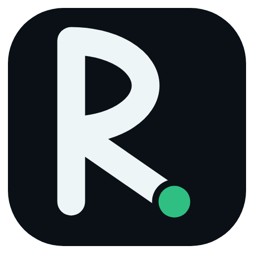
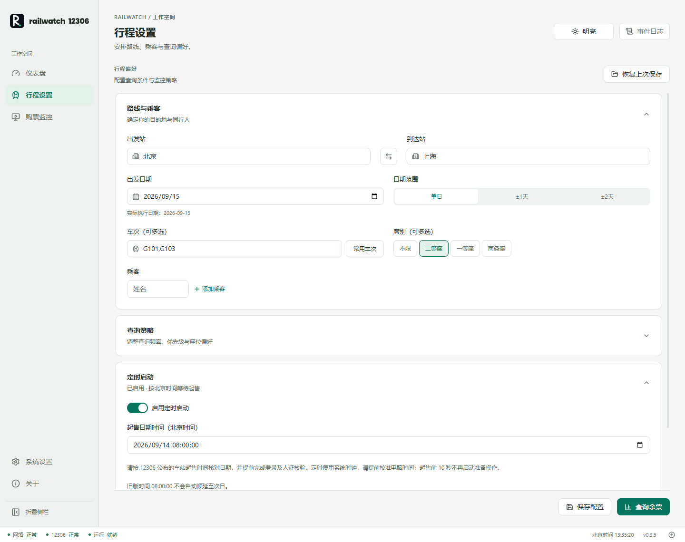
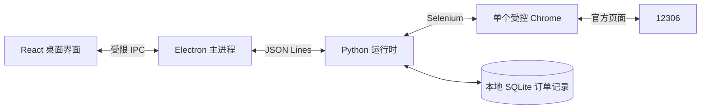

<div align="center">
  
  <h1>RailWatch 12306</h1>
  <p><strong>把行程准备、起售监控与订单跟踪，放在一个桌面工作台。</strong></p>
  <p>面向个人出行的开源 12306 辅助工具 · 本地运行 · 人工核验与支付</p>
  <p>
    <a href="https://github.com/shyrel666/RailWatch-12306/releases"></a>
    <a href="https://github.com/shyrel666/RailWatch-12306/actions/workflows/ci.yml"></a>
    <a href="LICENSE"></a>
    <a href="#download"></a>
  </p>
  <p>
    <a href="https://github.com/shyrel666/RailWatch-12306/releases"><strong>下载与发布</strong></a> ·
    <a href="#quick-start">快速上手</a> ·
    <a href="docs/transaction-reliability.md">可靠性说明</a> ·
    <a href="CHANGELOG.md">更新日志</a> ·
    <a href="https://github.com/shyrel666/RailWatch-12306/issues">问题反馈</a>
  </p>
</div>

> [!IMPORTANT]
> **v0.3.5 的交易自动化仍为实验性功能。** 真实账号下单与支付流程尚待人工验收。RailWatch 不是 12306 官方产品，不保证抢票成功或候补兑现；登录核验和支付须由你在官方页面完成。

<p align="center">
  <a href="#preview">界面预览</a> ·
  <a href="#features">核心功能</a> ·
  <a href="#download">下载安装</a> ·
  <a href="#faq">常见问题</a> ·
  <a href="#development">开发与构建</a> ·
  <a href="#architecture">架构</a>
</p>

<a id="preview"></a>

## 界面预览



<p align="center"><sub>当前前端的实际渲染截图，使用演示行程；未连接真实账号，所示车次与时间不作为购票依据。</sub></p>

通过 **仪表盘、行程设置、购票监控、系统设置** 四个页面，完成从准备行程到核对订单的操作；**关于** 页面汇总版本信息、项目链接与使用边界。

<a id="features"></a>

## 核心功能

| 能力 | 你可以做什么 |
| --- | --- |
| **行程与优先级** | 配置出发站、到达站、日期范围、目标车次、席别和乘客；运行中的任务保留启动时配置。 |
| **起售定时** | 填写完整北京时间起售时刻，提前准备查询页；等待期间防止自动休眠，恢复运行后重新检查。 |
| **现票优先** | 本轮先检查全部目标车次的现票，按配置顺序选择，避免前一行的候补掩盖后一行的现票。 |
| **候补辅助** | 均无现票时选择首选可候补组合；预订明确售罄且确认无订单后，立即进入候补路径。 |
| **订单跟踪与恢复** | 区分预订待支付、候补待支付、生效和兑现；保存提交意图，重启后可继续核对原订单。 |
| **提醒与人工接管** | 需要支付或核验时发出桌面与声音提醒；结果未知时暂停，避免盲目重复提交。 |

自动提交与自动候补默认关闭。启用后，提交前会回读目标车次、日期、区间、席别和乘客；候补还会核对截止时间及额外选项。**发现现票、点击提交，都不等于订单已经创建。**

<a id="download"></a>

## 下载安装

### Windows 用户

前往 **[GitHub Releases](https://github.com/shyrel666/RailWatch-12306/releases)**，在对应版本的 **Assets** 中下载 `.exe` 安装包，按向导安装。安装包命名格式为 `RailWatch-12306-<版本>-x64.exe`；实际可下载版本以发布页为准。

- 需要 **Windows 10/11** 和 **Google Chrome**。
- 安装包内置 Python 运行时，无需另装 Node.js 或 Python。
- 首次运行请在「系统设置」中检查环境，确认 Chrome 与 ChromeDriver 匹配。

| 平台 | 当前支持范围 |
| --- | --- |
| Windows | 已配置安装包构建与自动发布流程，是当前验证的主要平台。 |
| macOS / Linux | 可参考源码开发步骤；当前未提供对应安装包，也未完成同等平台验收。 |

<a id="quick-start"></a>

## 快速上手

1. **检查环境并登录**：在「系统设置」中检查环境、打开登录页，在官方页面完成登录和核验。
2. **配置行程**：填写路线、日期、车次、席别和乘客。使用定时功能时，先通过 [12306 起售查询](https://www.12306.cn/index/view/infos/sale_time.html) 核对车站起售时间，再填写完整日期与北京时间。
3. **保存并核对查询**：保存配置，点击「查询余票」，检查实际车次、区间和日期是否符合预期。
4. **启动监控**：在「购票监控」点击「启动监控」。需要自动提交或候补时，先明确配置目标并主动启用对应选项。
5. **处理提醒**：在官方页面完成人工核验或支付；若结果待核对，打开原订单详情后点击「继续处理／核对订单」。

> [!NOTE]
> **候补预付款支付后，候补订单才生效。** 提交后请尽快处理支付提醒，金额与期限以官方页面为准。参见 [12306 候补常见问题](https://kyfw.12306.cn/otn/gonggao/alternate.html)。

<a id="faq"></a>

## 常见问题

<details>
<summary><strong>能保证准点抢到票，或提高候补排队优先级吗？</strong></summary>

不能。工具可以提前准备页面、减少重复操作并记录各阶段时间，但票额、网络、官方排队与人工支付都影响结果。本地定时误差不代表官方下单时延，也不代表队列优先权。工程实测与限制见 [交易可靠性记录](docs/transaction-reliability.md)。

</details>

<details>
<summary><strong>升级后，旧定时配置和候补截止时间如何处理？</strong></summary>

旧配置只有时分秒时，需要补全起售日期，不会自动滚到次日。候补截止时间默认「开车前60分钟」，只接受官方页面实际提供且可回读确认的选项。旧的固定时刻若无法匹配，会转人工处理。

</details>

<details>
<summary><strong>为什么遇到超时或核验后，不能直接重新提交？</strong></summary>

点击请求可能已经被官方接受，只是页面没有及时返回。RailWatch 会保留提交意图，先核对原订单，防止重复提交。已有待支付、待核对或已生效候补时，当前版本会阻止新交易；候补生效后不会自动取消重建。

</details>

<details>
<summary><strong>数据保存在什么位置？</strong></summary>

Windows 默认保存在 `%LOCALAPPDATA%\railwatch-12306`，包括配置、日志、Chrome 会话、站码缓存及 `orders.sqlite3` 订单记录。订单记录包含乘客姓名和行程快照，请勿上传这些文件或包含个人信息的截图。

启用外部通知渠道后，提醒会发送至你配置的服务。使用前请确认接收目标；桌面应用并非离线购票工具，查询和交易仍需连接官方页面。

</details>

<a id="development"></a>

## 开发与构建

源码运行需要 **Node.js 20+、Python 3.10+、Chrome**，以及匹配的 ChromeDriver。下面以 Windows PowerShell 为例：

```powershell
git clone https://github.com/shyrel666/RailWatch-12306.git
cd RailWatch-12306
python -m venv .venv
.\.venv\Scripts\Activate.ps1
python -m pip install -r requirements.txt
npm ci
npm run dev
```

开发模式会启动 Electron 与 Vite，并由 Electron 启动 Python 运行时。macOS / Linux 的虚拟环境激活命令为 `source .venv/bin/activate`；平台兼容性仍需自行验证。

<details>
<summary><strong>常用命令与验证</strong></summary>

| 命令 | 用途 |
| --- | --- |
| `npm run dev` | 启动桌面开发环境。 |
| `npm test` | 运行 Electron 与 React 测试。 |
| `npm run build` | TypeScript 检查及前端、主进程生产构建。 |
| `npm run build:runtime` | 用 PyInstaller 构建 Python 运行时，需先安装 `pyinstaller`。 |
| `npm run package` | 构建应用、运行时和 Windows 安装包。 |

```powershell
python -X utf8 -m unittest discover -s tests -p "test_*.py"
python -X utf8 tests/browser_smoke.py
python -X utf8 tests/order_browser_smoke.py
python -X utf8 tests/timing_smoke.py --samples 1000
```

Chrome 回归使用独立临时配置和本地页面，阻断 12306 网络请求。测试通过不能代替真实账号下单验收。完整结果与故障覆盖见 [验收记录](docs/transaction-reliability.md)。

</details>

<details>
<summary><strong>构建 Windows 安装包</strong></summary>

```powershell
python -m pip install pyinstaller
npm run package
```

也可使用一键脚本 `.\package-windows.cmd 0.3.5`。该脚本会设置 npm 版本号并清理旧 `release/` 输出；维护新版本时需同步核对 `pyproject.toml` 和更新日志。

构建结果位于 `release/`。GitHub 的版本标签推送会触发 [Windows 打包工作流](https://github.com/shyrel666/RailWatch-12306/actions/workflows/package-windows.yml)，将安装程序、`.blockmap` 和 `latest.yml` 发布到对应 Release。

</details>

<a id="architecture"></a>

## 架构



界面与购票逻辑分层，浏览器任务串行持有交易权限；订单结果以匹配的官方页面证据为准。

| 目录 / 模块 | 职责 |
| --- | --- |
| [`src/`](src/) | React 界面、配置和状态展示。 |
| [`electron/`](electron/) | 窗口、受限 IPC、运行时管理与桌面提醒。 |
| [`railwatch_bridge.py`](railwatch_bridge.py) | 前后端命令入口与任务生命周期。 |
| [`gui_12306_0.py`](gui_12306_0.py) | Selenium 查询及监控核心。 |
| [`railwatch_order_page.py`](railwatch_order_page.py) | 交易页面适配、订单校验与核对。 |
| [`railwatch_orders.py`](railwatch_orders.py) | 提交意图、订单证据和阶段时间持久化。 |
| [`tests/`](tests/) | 单元测试、离线浏览器与运行时验证。 |

## 文档与参与贡献

| 你想了解 | 入口 |
| --- | --- |
| 当前版本变化 | [更新日志](CHANGELOG.md) · [v0.3.5 发布说明](docs/releases/v0.3.5.md) |
| 交易行为、恢复规则及实测限制 | [交易可靠性实现与验收记录](docs/transaction-reliability.md) |
| 如何开发和提交改进 | [贡献指南](CONTRIBUTING.md) |
| 发布前需要检查什么 | [发布检查清单](docs/RELEASE_CHECKLIST.md) |
| 报告问题或提出需求 | [GitHub Issues](https://github.com/shyrel666/RailWatch-12306/issues) |

欢迎改进文档、页面适配、故障恢复与测试覆盖。反馈问题时请附上应用、系统、Chrome 与 ChromeDriver 版本，以及脱敏的复现步骤和日志。

## 许可与使用边界

本项目采用 [MIT License](LICENSE)。请遵守 12306 用户协议、网站规则及适用法律法规。RailWatch 不绕过登录核验、验证码或频率限制，不使用非公开下单接口，不代替用户支付。

<p align="center"><sub>RailWatch 12306 · 为个人出行准备一个清晰、可核对的桌面工作台。</sub></p>
