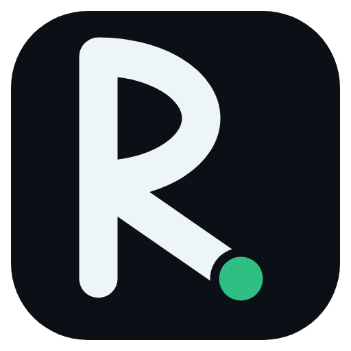
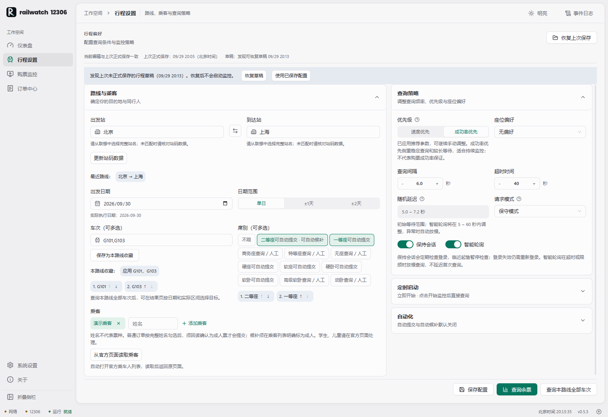

<div align="center">
  
  <h1>RailWatch 12306</h1>
  <p>本地运行的开源 12306 桌面辅助工具，支持行程配置、余票监控和订单跟踪。</p>
  <p>
    <a href="https://github.com/shyrel666/RailWatch-12306/releases">下载安装</a> ·
    <a href="#quick-start">快速上手</a> ·
    <a href="CHANGELOG.md">更新日志</a> ·
    <a href="https://github.com/shyrel666/RailWatch-12306/issues">问题反馈</a>
  </p>
</div>

<a id="preview"></a>



<a id="features"></a>

## 核心功能

- **行程配置**：路线、多日期、车次、席别和乘客，支持草稿与收藏。
- **余票监控**：起售定时、现票优先、自动提交与候补辅助。
- **订单跟踪**：支付提醒、状态核对与待处理订单恢复。
- **彩排与复盘**：开售前检查准备情况，运行后查看各阶段耗时。

<a id="download"></a>

## 下载安装

前往 [GitHub Releases](https://github.com/shyrel666/RailWatch-12306/releases)，下载 `RailWatch-12306-<版本>-x64.exe` 并安装。

需要 **Windows 10/11 + Google Chrome**。安装包内置 Python，无需另装 Node.js 或 Python；macOS / Linux 暂无安装包，尚未完成平台验收。

<a id="quick-start"></a>

## 快速上手

1. 在「系统设置」中检查环境，确认 Chrome 与 ChromeDriver 匹配，并在官方页面完成登录。
2. 在「行程设置」中填写路线、日期、车次、席别和乘客，保存后查询余票，核对结果。
3. 按需启用自动提交、候补或定时，再在「购票监控」中启动任务；定时需填写完整日期与北京时间，并核对车站起售时间。
4. 收到提醒后在官方页面完成核验或支付；结果待核对时，先核对原订单。

> 非 12306 官方产品，不保证购票或候补成功。自动候补仍为实验性功能，支付同步、候补兑现及异常恢复尚未完整验收；订单状态以官方页面为准。

<a id="development"></a>

## 源码运行

需要 **Node.js 22.13+、Python 3.10+、Chrome** 及匹配的 ChromeDriver。以下以 Windows PowerShell 为例：

```powershell
git clone https://github.com/shyrel666/RailWatch-12306.git
cd RailWatch-12306
python -m venv .venv
.\.venv\Scripts\Activate.ps1
python -m pip install -r requirements.txt
npm ci
npm run dev
```

构建应用：`npm run build`。打包 Windows 安装程序：先执行 `python -m pip install pyinstaller`，再执行 `npm run package`，产物位于 `release/`。

## 更多文档

- [交易与恢复说明](docs/transaction-reliability.md) · [多日期查询与性能说明](docs/efficiency-phase1.md)
- [多组合候补与持续订单核对](docs/efficiency-phase2.md)
- [贡献指南](CONTRIBUTING.md) · [发布检查清单](docs/RELEASE_CHECKLIST.md)
- [隐私与本地数据](PRIVACY.md)

本项目采用 [MIT License](LICENSE)。请遵守 12306 用户协议与网站规则，反馈问题时请隐去个人信息。
