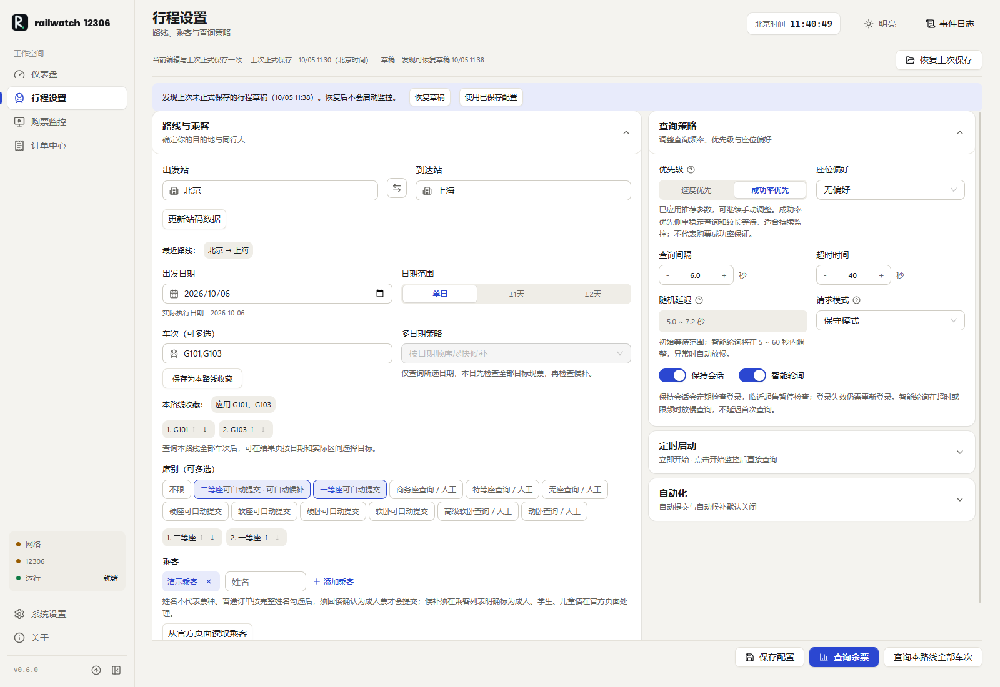
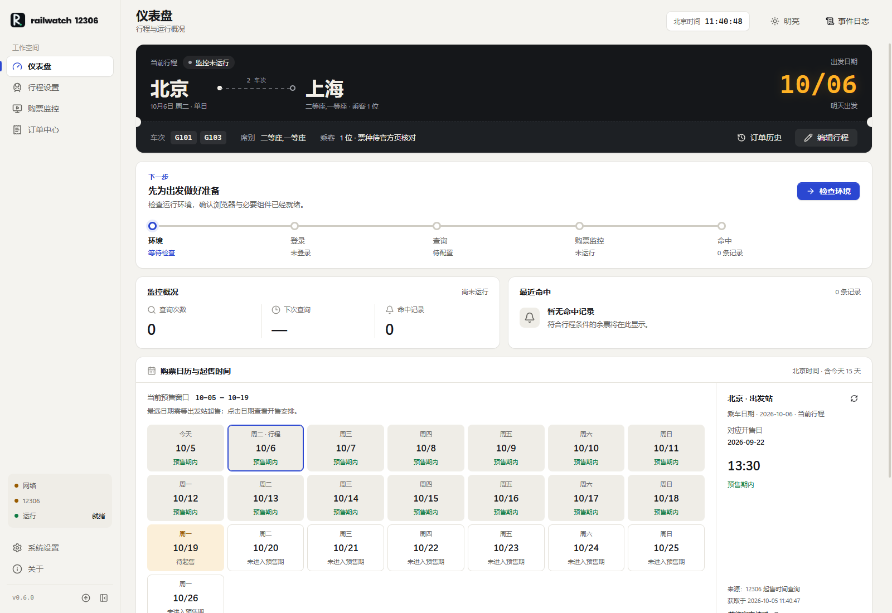
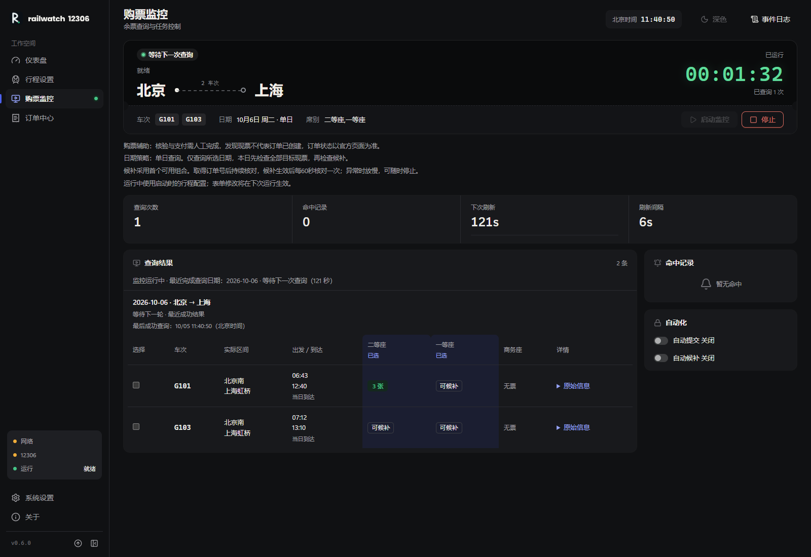
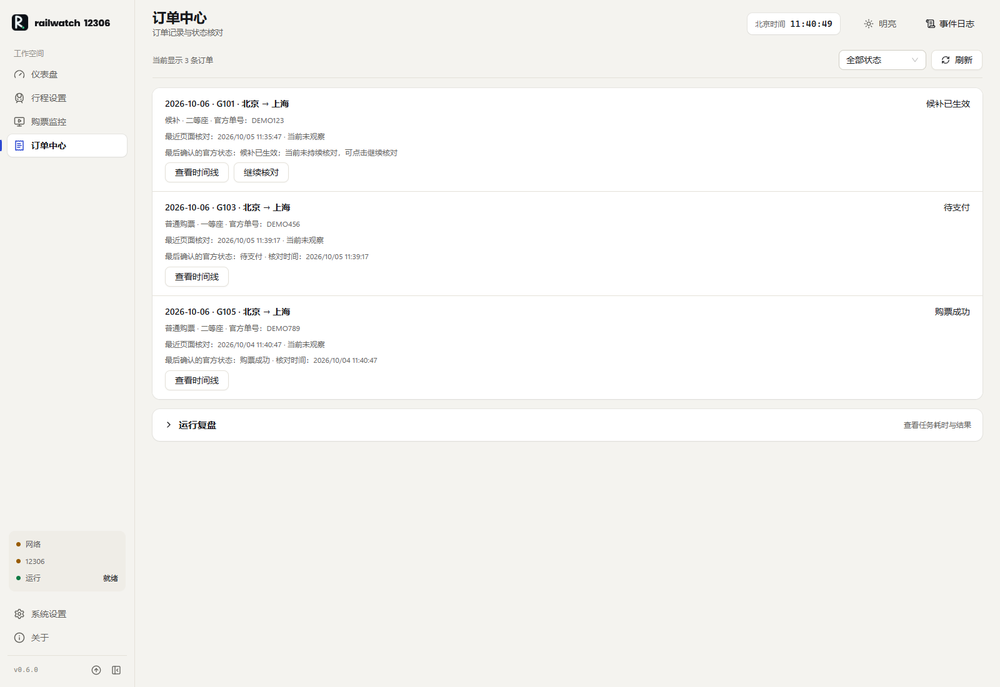

<div align="center">
  
  <h1>RailWatch 12306</h1>
  <p><strong>本地运行的开源 12306 桌面辅助工具</strong></p>
  <p>行程配置 · 余票监控 · 自动提交与候补辅助 · 订单跟踪 · 起售彩排</p>
  <p>
    <a href="https://github.com/shyrel666/RailWatch-12306/releases/latest"></a>
    <a href="https://github.com/shyrel666/RailWatch-12306/releases"></a>
    
    <a href="LICENSE"></a>
    <a href="https://github.com/shyrel666/RailWatch-12306/stargazers"></a>
  </p>
  <p>
    <a href="#download"><strong>下载安装</strong></a> ·
    <a href="#quick-start">快速上手</a> ·
    <a href="#screenshots">界面预览</a> ·
    <a href="#development">源码运行</a> ·
    <a href="CHANGELOG.md">更新日志</a> ·
    <a href="https://github.com/shyrel666/RailWatch-12306/issues">问题反馈</a>
  </p>
</div>

<a id="preview"></a>

<p align="center">
  
</p>

<a id="features"></a>

## 核心功能

- **行程配置**：路线、多日期、车次、席别和乘客，支持草稿恢复与路线收藏；可从官方页面读取乘车人。
- **余票监控**：起售定时与多日期策略，现票优先；自动提交与候补辅助默认关闭，启用前需确认。
- **订单跟踪**：支付提醒、持续订单核对与待处理订单恢复，可在订单中心查看每笔订单的处理时间线。
- **彩排与复盘**：开售前只读检查准备情况，运行后按阶段查看耗时，定位慢在哪一步。

<a id="screenshots"></a>

## 界面预览

<table>
  <tr>
    <td width="33%" align="center" valign="top">
      <a href="docs/images/dashboard-v0.6.0.png"></a>
      <br><sub><b>仪表盘</b> · 发车牌、下一步与购票日历</sub>
    </td>
    <td width="33%" align="center" valign="top">
      <a href="docs/images/monitor-v0.6.0.png"></a>
      <br><sub><b>购票监控</b> · 深色主题、查询结果与命中记录</sub>
    </td>
    <td width="33%" align="center" valign="top">
      <a href="docs/images/order-center-v0.6.0.png"></a>
      <br><sub><b>订单中心</b> · 订单状态与官方核对</sub>
    </td>
  </tr>
</table>

<a id="download"></a>

## 下载安装

前往 [GitHub Releases](https://github.com/shyrel666/RailWatch-12306/releases) 下载对应平台的安装包。安装包内置 Python 运行时，无需另装 Node.js 或 Python，但需要安装 **Google Chrome**。

| 平台 | 安装包 | 应用内更新 |
| --- | --- | --- |
| Windows 10/11 | `RailWatch-12306-<版本>-x64.exe` | 自动下载，点击「立即重启安装」 |
| macOS 12 及以上（Apple Silicon） | `RailWatch-12306-<版本>-arm64.dmg` | 提示新版本，点击「前往下载」手动安装 |
| macOS 12 及以上（Intel） | `RailWatch-12306-<版本>-x64.dmg` | 同上 |

<details>
<summary><b>macOS 安装说明</b>（选择芯片版本、首次打开、钥匙串授权、升级）</summary>

<br>

1. **选择芯片版本**：打开「苹果菜单 → 关于本机」，「芯片」显示 Apple M 系列选 `arm64.dmg`，显示 Intel 选 `x64.dmg`。
2. 打开 DMG，把 RailWatch 12306 拖入「应用程序」文件夹。
3. **首次打开**：当前 macOS 安装包未经 Apple 公证，系统会提示无法验证开发者。先尝试打开一次，再到「系统设置 → 隐私与安全性」点击「仍要打开」（macOS 15 起右键「打开」已不能绕过）。也可以在终端执行：

   ```bash
   xattr -dr com.apple.quarantine "/Applications/RailWatch 12306.app"
   ```

4. **通知凭据与钥匙串**：邮箱授权码、Server 酱 Key 和企业微信 Webhook 保存在系统钥匙串中。手动升级后首次启动可能弹出一次钥匙串授权框（发起程序显示为 `railwatch_runtime`），选择「始终允许」即可；选择拒绝只会停用外部通知，可稍后重新填写。
5. **升级**：应用发现新版本后点击「前往下载」，下载新的 DMG 覆盖安装，配置和订单记录会保留。

Intel 版依赖 GitHub 提供的 Intel 构建机，GitHub 已公告该构建机支持至 2027 年 8 月，之后 Intel 版的去向会提前在发布说明中公告。

</details>

<a id="quick-start"></a>

## 快速上手

1. **检查环境**：在「系统设置」中确认 Chrome 与 ChromeDriver 匹配，并在官方页面完成登录。
2. **配置行程**：在「行程设置」中填写路线、日期、车次、席别和乘客，保存后查询余票，核对结果。
3. **启动监控**：按需启用自动提交、候补或定时，再在「购票监控」中启动任务；定时需填写完整日期与北京时间，并核对车站起售时间。
4. **完成订单**：收到提醒后在官方页面完成核验或支付；结果待核对时，先核对原订单。

<a id="development"></a>

## 源码运行

**技术栈**：Electron · React · Ant Design · TypeScript · Vite（界面）＋ Python · Selenium（运行时）

需要 **Node.js 22.13+、Python 3.10+、Chrome** 及匹配的 ChromeDriver。以下以 Windows PowerShell 为例：

```powershell
git clone https://github.com/shyrel666/RailWatch-12306.git
cd RailWatch-12306
python -m venv .venv
.\.venv\Scripts\Activate.ps1
python -m pip install -r requirements.txt
npm ci
npm run dev
```

## 文档

| 文档 | 内容 |
| --- | --- |
| [交易与恢复说明](docs/transaction-reliability.md) | 交易可靠性、持久化恢复与起售调度 |
| [多日期查询与性能说明](docs/efficiency-phase1.md) | 抢票与候补流程的效率优化及对比结果 |
| [多组合候补与持续订单核对](docs/efficiency-phase2.md) | 多组合的选择与提交、持续核对的状态依据 |
| [隐私与本地数据](PRIVACY.md) | 本地保存的数据与不会做的事 |
| [发布检查清单](docs/RELEASE_CHECKLIST.md) | 发版前的自动验证、安装包冒烟与人工 QA |

## 参与贡献

欢迎提交 Issue，开始前请阅读 [贡献指南](CONTRIBUTING.md)；安全问题请按 [安全策略](SECURITY.md) 报告。反馈问题时请隐去个人信息。

## 许可证

本项目采用 [MIT License](LICENSE)。请遵守 12306 用户协议与网站规则。
