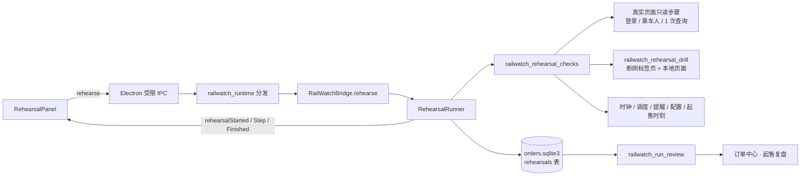
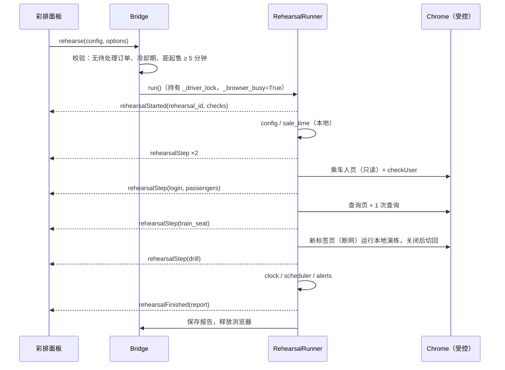

# 起售彩排与实战复盘：实施方案

| 项目 | 内容 |
| --- | --- |
| 目标版本 | v0.5.0 |
| 基线代码 | `main`（v0.4.2 之后，含 2026-09-28 审查修复） |
| 状态 | M0–M4 已实现并验证；M5 自动彩排、文档与构建完成，已登录真实路径待会话恢复后验收（详见 docs/v0.5.0-validation.md） |
| 预估工作量 | 约 9 个工作日（M0–M5） |

## 1. 一句话定义

> 2026-09-28 M0 实测修正：详见 [`docs/v0.5.0-m0-validation.md`](docs/v0.5.0-m0-validation.md)。旅客类型列当前不显示，普通联系人可从编辑链接元数据只读提取类型，本人类型保持 unknown；身份核验读图标 title，须区分“预通过”和证件相关例外，不能将所有非“已通过”均判作官方禁止购票；单独 `Network.setBlockedURLs` 未能阻止本机 Chrome 的主页面导航，演练还必须启用标签页离线和 file 导航守卫。以下章节与这些实测结论冲突时，以实测修正为准。

在开售前，把真正抢票时要走的路径完整预演一遍：**不点击任何会产生订单的按钮**，逐项给出“通过 / 有风险 / 会失败 / 无法判断”，并附一键修复入口；开售结束后，用已经记录的阶段时间生成“实战复盘”时间线。

## 2. 背景：为什么现在做

### 2.1 失败发现得太晚

当前能在开售前发现的问题只有静态配置错误；其余问题都要到 T+0 才以 `verification` 的形式出现，而那时已经来不及修：

| 失败类型 | 现在在哪里暴露 | 位置 |
| --- | --- | --- |
| 车次、乘客、席别配置不完整 | 启动前（静态） | `src/lib/automationReadiness.ts`、`RailWatchBridge.start_monitor` |
| 乘客同名、折叠区同名、票种非成人 | 进入下单页后 | `OrderPage.prepare_people` → `SELECT_PASSENGERS_JS` |
| 登录会话过期 | 定时准备阶段或开售时 | `_monitor_worker` → `_send_keep_alive` |
| 目标车次在该线路不存在、席别不开行 | 首轮查询后 | `TicketMonitor` 查询与命中判定 |
| 起售时刻填错（与官方车站起售时间不一致） | 永远不报，只会“空等” | 仅前端 `saleDay` 能算，后端不核对 |
| 系统时钟偏差、机器高负载导致唤醒迟到 | 事后看 `scheduler_wake.late_ms` | `_wait_for_target_timestamp` |
| 外部提醒渠道失效 | 真正需要支付提醒时 | `NotificationService` |

### 2.2 项目已经有的零件

这个功能的大部分能力已经存在，只是没有串起来：

| 能力 | 现有实现 |
| --- | --- |
| 浏览器独占与串行化 | `idle_browser_command`、`_driver_lock`、`_browser_busy`（`railwatch_bridge.py`） |
| 登录校验（只读 `checkUser`） | `LOGIN_CHECK_JS`（`railwatch_query.py`） |
| 单次合规查询 | `PageAnalyzer.open_fill_query_and_analyze` + `QueryExecutor`（含 429/503 处理） |
| 乘客勾选与票种判定规则 | `PASSENGER_FIELDS_JS`、`SELECT_PASSENGERS_JS`（`railwatch_order_page.py`） |
| 离线交易页面演练 | `OrderPage(allow_fixture=True)` + `tests/fixtures/orders.html` |
| 自动化配置校验（前后端一致） | `automationConfigIssue` / `start_monitor` + `tests/fixtures/automation-readiness-cases.json` |
| 官方车站起售时间 | `SaleTimeService`（`railwatch_sale_times.py`，1 小时缓存）与前端 `saleDay` |
| HTTP 时间辅助检查 | `ServerTimeSync.sync`、`sync_server_time` |
| 分阶段耗时持久化 | `OrderJournal.mark` / `record_telemetry` → `order_events`（墙钟 + 单调时间） |
| 提醒渠道状态 | `NotificationService.status` / `test_notification` |

### 2.3 非目标

- 不预测余票、不承诺成功率，不提供“成功概率”一类数字。
- 不做中转、买长乘短等需要额外查询组合的功能（会显著增加请求量，与 2026-09-11 风控审查的收紧方向冲突）。
- 不在真实官方页面上演练交易步骤；交易路径只在本地页面演练。
- 不引入新的外部服务或上传任何数据。

## 3. 现状约束（设计必须遵守）

以下约束来自实际代码，直接决定了架构选择：

1. **浏览器是独占资源。**`idle_browser_command` 在 `_task_lock` 下检查 `is_monitoring` 与 `_browser_busy`，任何浏览器命令都与监控互斥。彩排必须作为一个浏览器命令运行，且**内部不能调用其他被装饰的命令**（例如 `check_login`、`read_passengers`），否则会因 `_browser_busy` 已为真而抛错。需要复用的逻辑要抽成未装饰的内部方法。
2. **定时任务从启动起就持有浏览器。**`start_monitor` 启动后，`_monitor_worker` 持有 `_driver_lock` 直到任务结束，等待期由 `_wait_for_target_timestamp` 管理。因此“开售前 30 分钟自动彩排”不能作为独立命令插入，只能放进任务内部、在开始等待之前执行（见第 9 节）。
3. **最后 10 秒不导航、不联网、不探测登录。**`_wait_for_target_timestamp` 已有此约束；任务内彩排必须在起售前足够早完成。
4. **前端按 `run_id` 过滤事件。**`App.tsx` 的 `applyEvent` 会丢弃 `run_id` 与当前任务不一致的事件；`RailWatchBridge.emit` 会在任务线程里自动附加 `run_id`。独立彩排的事件不能带 `run_id` 字段，改用 `rehearsal_id`。
5. **退出与更新会等待浏览器空闲最多 20 秒。**`prepare_shutdown` 轮询 `_browser_busy`。彩排可能持续 30–60 秒，必须支持协作式取消，并在 `prepare_shutdown` 中触发取消。
6. **`order_events` 没有 `run_id` 索引。**现有索引是 `(intent_id, stage)`、`(stage, sequence DESC)` 等；复盘按 `run_id` 读取需要新增索引。查询遥测（`query_click`/`query_result`）按 20,000 条上限裁剪，老任务的查询事件可能已不完整。
7. **起售时刻只在前端计算。**`saleDay`（`src/lib/saleCalendar.ts`）实现了“预售天数 + 车站起售时间 + 起止日期开区间”的规则；后端没有等价实现。彩排要在后端核对，必须移植，并用共享用例锁定两边一致（沿用 `automation-readiness-cases.json` 的做法）。
8. **测试 fixture 不进安装包。**`RailWatch_runtime.spec` 只打包 `railwatch_policies/query_strategies.json`；`tests/fixtures/orders.html` 不可用于生产。离线演练页面需要内置在运行时模块里。
9. **CI 不跑浏览器冒烟测试。**`.github/workflows/ci.yml` 只跑 `unittest discover`、`py_compile`、`npm run test`、`npm run build`。新增的浏览器冒烟测试要写进发布检查清单。

## 4. 用户体验

### 4.1 入口

- **购票监控页**：命令区下方新增“起售彩排”卡片（`id="monitor-rehearsal"`），按钮“开始彩排”，运行中显示“取消彩排”。
- **仪表盘**：当启用了定时或自动化，且（没有彩排记录 / 彩排后配置已修改 / 最近结论不是“就绪”）时，下一步行动卡显示“开售前先彩排一次”，跳转到 `monitor-rehearsal`。
- **定时任务**：新增偏好“定时任务开始等待前自动彩排”（默认开启），见第 9 节。

### 4.2 运行中

检查清单逐项点亮。每项一行：状态图标、标题、一句话结论、耗时；失败或有风险的项右侧有修复按钮（复用 `setActivePage(page, section)`，与“完善自动化配置”按钮同一模式）。

### 4.3 结论

| 结论 | 条件 | 展示 |
| --- | --- | --- |
| 就绪 | 无失败项，关键项无“无法判断” | 绿色，“开售时的主要路径已验证” |
| 有风险 | 存在警告、非关键失败或关键项无法判断 | 橙色，列出风险项 |
| 会失败 | 任一关键项失败 | 红色，“按当前配置，开售时会在 X 步停止” |
| 已取消 | 用户取消或应用退出 | 灰色 |

配置在彩排后被修改时，卡片顶部显示“行程已修改，彩排结果已过期”。判定方式：保存发起彩排时的 `tripFingerprint(config)`，与当前草稿比较（`tripFingerprint` 已在 `src/store/railwatchStore.ts` 中定义）。

### 4.4 预测时间线与复盘

- 彩排完成后显示“预测时间线”：从起售时刻 T0 开始，按阶段画横向条形，每段标注数据来源（本机实测 / 历史中位数 / 未知），不把本地脚本耗时冒充官方处理时间。
- 任务结束后，在订单中心新增“起售复盘”列表，打开后显示同一张图的实际值，并自动指出最慢的一段。

## 5. 检查项规格

每个检查项是一个独立函数，返回统一结构（见 6.4）。“关键”表示失败会使结论变为“会失败”。

| ID | 标题 | 关键 | 真实页面操作 | 网络请求 |
| --- | --- | --- | --- | --- |
| `config` | 自动化配置 | 是（启用自动化时） | 无 | 0 |
| `sale_time` | 起售时刻 | 是（启用定时时） | 无 | 0–1（官方起售数据，有 1 小时缓存） |
| `browser` | 受控浏览器 | 是 | 无 | 0 |
| `login` | 登录会话 | 是 | 可能导航到乘车人页 | 1（`checkUser`） |
| `passengers` | 乘车人 | 是（启用自动化时） | 导航到乘车人页，只读 | 1 次页面加载 |
| `train_seat` | 车次与席别 | 是（启用自动化时） | 导航到查询页，1 次查询 | 1 次页面加载 + 1 次查询 |
| `drill` | 交易路径演练 | 是（启用自动提交或自动候补时） | 无（本地页面，断网标签页） | 0 |
| `clock` | 系统时钟 | 否 | 无 | 1（HEAD `login.html`） |
| `scheduler` | 定时唤醒 | 否 | 无 | 0 |
| `alerts` | 提醒渠道 | 否 | 无 | 0（可选发送测试提醒） |

执行顺序：`config` → `sale_time` → `browser` → `login` → `passengers` → `train_seat` → `drill` → `clock` → `scheduler` → `alerts`。浏览器相关项前置的失败会让后续依赖项标为 `skipped` 并说明原因；纯本地项总是执行。

### 5.1 `config`：自动化配置

- **做法**：把 `start_monitor` 中的自动化校验抽成 `automation_config_issue(config) -> Optional[str]`（放在 `railwatch_config_contract.py`），`start_monitor` 改为 `if issue: raise ValueError(issue)`，彩排直接复用。
- **判定**：有问题为 `fail`，修复入口“行程设置 · trip-basics”；未启用自动化为 `pass` 并注明“仅监控余票”。
- **一致性**：继续使用 `tests/fixtures/automation-readiness-cases.json`，新增一条 Python 测试直接调用 `automation_config_issue`。

### 5.2 `sale_time`：起售时刻

- **做法**：在 `railwatch_sale_times.py` 新增 `official_sale_at(station, travel_date, now, window_days)`，逐条移植 `saleDay` 的规则：
  - 起售日期 = 出行日期 − (预售天数 − 1)；
  - 只取站名完全相同、`start_date < 起售日期 < stop_date`（开区间）的记录；
  - 多条记录给出不同时刻时视为无法判断。
- **判定**：
  - 启用定时且 `sale_at` 与官方时刻一致：`pass`；
  - 不一致：`fail`，给出官方时刻与“一键改为官方时刻”的修复入口（行程设置 · 定时区块）；
  - 官方数据不可用或无法唯一确定：`unknown`；
  - 未启用定时但目标日期尚未起售：`warn`，建议启用定时；
  - 距起售不足 5 分钟：不允许手动彩排（见第 7 节）。
- **一致性**：新建 `tests/fixtures/sale-time-cases.json`，同时被 `tests/test_sale_times.py` 和 `src/lib/saleCalendar.test.ts` 读取，覆盖开区间边界、多记录冲突、跨月、预售窗口外等情况。

### 5.3 `browser`：受控浏览器

- **做法**：检查 `self.driver` 是否存在且 `driver_session_alive`；读取 `detect_chrome_version` 与 `detect_chromedriver_version` 比较大版本。**不自动启动浏览器**：未登录的新浏览器没有意义，也会让用户误以为彩排替他登录了。
- **判定**：浏览器未打开为 `fail`（修复入口“系统设置 · settings-login”，文案“打开登录页”），版本不匹配为 `warn`（修复入口“系统设置 · settings-environment”）。浏览器不可用时，`login`、`passengers`、`train_seat`、`drill` 均为 `skipped`。

### 5.4 `login`：登录会话

- **做法**：`LOGIN_CHECK_JS` 要求当前页面在 `kyfw.12306.cn` 域下。若当前不在该域，先导航到乘车人页（5.5 本来就要去），再执行校验；若被重定向到 `login.html`，直接判定未登录。
- **判定**：`ok` → `pass`，并像 `check_login` 一样调用 `with_login_verified(True, ...)` 更新全局状态；`expired` → `fail`；`unknown` → `unknown`。
- **复用**：把 `check_login` 的主体抽成未装饰的 `_verify_login_session() -> str`，两处共用。

### 5.5 `passengers`：乘车人

价值最高的一项：能在开售前发现同名、折叠区同名、票种不是成人、身份未核验等问题。

- **页面**：12306 个人中心的常用乘车人页面（候选地址 `https://kyfw.12306.cn/otn/view/passengers.html`）。**页面结构、分页方式和“核验状态”的实际取值必须在 M0 通过只读核对确认**，确认前该检查的实现以 fixture 为准。
- **读取**：新增 `READ_PASSENGER_BOOK_JS`，只读取可见表格行：姓名、旅客类型、核验状态、证件号脱敏摘要。存在分页时，只点击分页控件（页面内导航，不涉及订单），最多读取 10 页或 100 人。
- **判定**（与 `SELECT_PASSENGERS_JS` 的规则保持一致）：

| 情况 | 结论 |
| --- | --- |
| 配置的姓名未找到完整匹配 | `fail`：“常用乘车人中没有该完整姓名” |
| 同名多于 1 人 | `fail`：“同名，自动勾选会被拒绝，请在官方页面处理” |
| 旅客类型为学生或儿童 | `fail`：“自动交易仅支持成人票” |
| 旅客类型无法识别 | 自动提交为 `warn`（普通订单会在下单页回读票种），自动候补为 `fail`（与 `SELECT_PASSENGERS_JS` 对候补的规则一致） |
| 核验状态不是“已通过” | `fail`：“身份核验未通过，官方不允许购票” |
| `passenger_selections` 里的证件摘要与页面不一致 | `warn`：“与导入时的乘客可能不是同一人” |
| 页面结构无法识别 | `unknown`，不阻断，并提示“将在下单页按原规则核对” |

- **隐私**：报告中姓名按“首字 + *”脱敏，证件摘要沿用现有 `identity_hint` 格式（`张***三` 一类），不保存完整证件号。

### 5.6 `train_seat`：车次与席别

- **探测日期**：目标日期已经开售时用目标日期；否则用“同线路最近可售日期”（今天 + 预售天数 − 1，且不早于今天）。结果中注明“基于 X 日的运行图，目标日期可能不同”。
- **做法**：从 `analyze_query` 中抽出未装饰的 `_probe_query(driver, date_config) -> (rows, last_query)`：
  - 复用 `PageAnalyzer.open_fill_query_and_analyze`；
  - 不发 `results` 事件，不修改 `query_ready`，不覆盖 `self.query_results`；
  - 查询结束后浏览器停留在查询页，正好方便随后启动监控（`_prepare_query_page` 第一次尝试会直接在当前查询页填参）。
- **判定**：对每个目标车次检查行是否存在，以及每个目标席别的值是否为 `--`（该车次不开行此席别）。
  - 所有目标车次都没有任何目标席别：`fail`；
  - 部分车次缺失或部分席别不开行：`warn`，逐条列出；
  - 查询被限流（`rate_limited` / `server_backoff`）：`warn`，展示 `retry_after_seconds`，**不重试**；
  - 查询超时或页面异常：`unknown`。
- **附带产出**：从行中读取实际发到站（`row_parser.selected_route`），供 5.7 构造演练意图，这与真实下单时 `OrderIntent` 的路线来源一致。
- **计时**：`QueryExecutor.execute` 在点击前记录单调时间，并在返回结果中增加 `round_trip_ms`（点击到结果稳定），用于预测时间线。这是对查询执行器的唯一改动，且只增加字段。

### 5.7 `drill`：交易路径演练

在用户自己的 Chrome 版本上，用用户自己的车次、乘客、席别和路线，把 `OrderPage.regular()` / `OrderPage.alternate()` 在本地页面上完整跑一遍。

- **能发现什么**：
  - 站名边界匹配问题（例如配置“北京”、实际发站“北京南”）；
  - 席别标签带票价后缀；
  - 姓名含间隔号、空格或括号时的匹配问题；
  - 页面脚本在新版 Chrome 上的兼容性；
  - 座位偏好应用；
  - 候补截止时间回读。
- **不能证明什么**：本地页面模拟的是项目对官方页面的理解，不能证明官方页面结构没有变化。界面上必须写明“离线演练，仅验证 RailWatch 自身的核对逻辑”。
- **页面来源**：新建 `railwatch_rehearsal_drill.py`，内置演练页面模板（由 `tests/fixtures/orders.html` 演化而来）。用户数据以 JSON 注入（转义 `</`），页面脚本只用 `textContent` 和 `createElement` 构建 DOM，不用 `innerHTML` 拼接用户数据。模板随模块打包，不改 PyInstaller 配置。
- **隔离**：
  1. 在数据目录下创建临时目录并写入 HTML，`finally` 中删除；
  2. `driver.switch_to.new_window("tab")` 打开新标签页，记录原标签页句柄；
  3. 在新标签页执行 `Network.enable` 和 `Network.setBlockedURLs`（`http://*`、`https://*`、`ws://*`、`wss://*`），确保演练过程中任何代码路径都无法访问网络（包括 `OrderPage.reconcile` 中的 `driver.get(订单页)`）；
  4. 运行前断言当前地址协议为 `file`、当前句柄为演练句柄，否则拒绝运行；
  5. `OrderPage` 使用 `allow_fixture=True`，`mark` 与 `log` 传入空实现，**不写 `order_journal`**；
  6. `finally` 中关闭演练标签页，切回原句柄，并确认原标签页地址的主机名未变。
- **判定**：
  - 普通订单：结果为 `pending_payment`，且页面计数器显示提交 1 次、确认 1 次，为 `pass`；
  - 候补：结果为 `pending_payment`，截止时间回读一致，为 `pass`；
  - 其他结果：`fail`，并附上 `OrderResult.reason` 与 `form_mismatch_report` 的字段级差异（已按现有规则脱敏）；
  - 同时记录各阶段的本地耗时，但时间线上标注为“本地脚本耗时”。

### 5.8 `clock`：系统时钟

- **做法**：调用 `ServerTimeSync.sync(force=True)`（一次 HEAD 请求），读取 `offset_seconds` 与 `uncertainty_seconds`。
- **判定**：`|偏差| ≤ 1s` 为 `pass`，`1–3s` 为 `warn`，`> 3s` 为 `fail`（非关键）；失败或无不确定度为 `unknown`。文案强调“定时使用系统时钟，请在系统设置中开启自动对时”，与 `transaction-reliability.md` 的表述一致。

### 5.9 `scheduler`：定时唤醒

- **做法**：新增 `sample_scheduler_lateness(samples=24, lead=0.25)`，完全模拟 `_wait_for_target_timestamp` 最后 10 秒的等待方式（`Event.wait(min(0.02, remaining))`），记录每次唤醒迟到的毫秒数，同时检查墙钟与单调时钟的漂移。总耗时约 6 秒，不占用浏览器，可与浏览器检查并行。
- **判定**：P95 ≤ 100ms 为 `pass`，≤ 250ms 为 `warn`，否则 `fail`（非关键）。阈值沿用 `transaction-reliability.md` 中本地唤醒的目标（P95 ≤ 100ms、P99 ≤ 250ms）。

### 5.10 `alerts`：提醒渠道

- **做法**：读取 `NotificationService.status()` 和渠道配置状态。默认**不发送**；只有用户在彩排选项中勾选“同时发送测试提醒”时，才调用 `test_notification()`。
- **判定**：已启用但未配置完整或最近一次发送失败为 `warn`；全部未启用为 `pass`，并注明“仅桌面提醒”。

## 6. 架构设计

### 6.1 模块划分



| 文件 | 职责 |
| --- | --- |
| `railwatch_rehearsal.py`（新） | `RehearsalRunner`：检查项编排、依赖跳过、取消、结论计算、事件发送、报告持久化 |
| `railwatch_rehearsal_checks.py`（新） | 10 个检查函数，均为纯输入输出，依赖通过参数注入，便于用假驱动测试 |
| `railwatch_rehearsal_drill.py`（新） | 演练页面模板、隔离标签页上下文管理器、演练执行 |
| `railwatch_run_review.py`（新） | 纯函数：从 `order_events` 计算阶段分段、预测时间线 |
| `railwatch_bridge.py`（改） | 新命令、内部方法抽取、取消接线、`prepare_shutdown` 触发取消 |
| `railwatch_orders.py`（改） | `rehearsals` 表、`run_id` 索引、按任务读取事件 |
| `railwatch_config_contract.py`（改） | `automation_config_issue` |
| `railwatch_sale_times.py`（改） | `official_sale_at` |
| `railwatch_query.py`（改） | `QueryExecutor.execute` 返回 `round_trip_ms` |
| `railwatch_order_page.py`（改） | 新增 `READ_PASSENGER_BOOK_JS`，复用 `PASSENGER_FIELDS_JS` 中的票种判定 |
| `railwatch_preferences.py`、`railwatch_runtime.py`（改） | 偏好 `auto_rehearsal` 的读写（经 `savePreferences`）；新命令分发 |

### 6.2 时序



### 6.3 命令与事件契约

新增命令（同步加入 `electron/ipcSecurity.ts` 的 `RAILWATCH_COMMANDS` 与 `railwatch_runtime.py` 的分发表）：

| 命令 | 载荷 | 返回 | 说明 |
| --- | --- | --- | --- |
| `rehearse` | `{config, options?: {send_test_notification?: boolean}}` | 报告 | 浏览器命令；加入 `LONG_RUNNING_COMMANDS`；需要确认对话框（见第 7 节） |
| `cancelRehearsal` | `{}` | `{cancelled: boolean}` | 非浏览器命令，只设置取消事件 |
| `rehearsalHistory` | `{limit?}` | `{items: 报告摘要[]}` | 最近 20 条 |
| `runReviews` | `{limit?, cursor?}` | `{items: 任务摘要[], next_cursor}` | 按任务列出，含起售时刻、结论 |
| `runReview` | `{run_id}` | 复盘详情 | `run_id` 按 `[A-Za-z0-9_-]{1,128}` 校验，与 `history_detail` 相同 |

新增事件（`App.tsx` 的 `applyEvent` 新增三个分支；独立彩排的载荷不含 `run_id`）：

| 事件 | 载荷 |
| --- | --- |
| `rehearsalStarted` | `{rehearsal_id, trigger, checks: [{id, title, critical}]}` |
| `rehearsalStep` | `{rehearsal_id, check: 检查结果}` |
| `rehearsalFinished` | `{report}` |

### 6.4 数据结构

检查结果：

```json
{
  "id": "passengers",
  "title": "乘车人",
  "critical": true,
  "status": "pass | warn | fail | unknown | skipped",
  "summary": "2 位乘车人均唯一匹配，旅客类型为成人，核验已通过",
  "details": ["张*：成人 · 已通过", "李*：成人 · 已通过"],
  "fix": {"page": "行程设置", "section": "trip-basics", "label": "修改乘车人"},
  "duration_ms": 1830
}
```

报告：

```json
{
  "schema_version": 1,
  "rehearsal_id": "3f2c...",
  "trigger": "manual | task",
  "started_at": 1790000000.0,
  "finished_at": 1790000041.2,
  "verdict": "ready | risky | blocked | cancelled",
  "trip": {
    "from_station": "北京南", "to_station": "上海虹桥", "date": "2026-10-12",
    "train_codes": ["G9"], "seat_types": ["二等座"], "passenger_count": 2,
    "auto_submit": true, "auto_alternate": false, "sale_at": "2026-09-28T15:00:00+08:00",
    "probe_date": "2026-10-11"
  },
  "checks": ["检查结果 ..."],
  "measurements": {
    "query_round_trip_ms": 1240,
    "scheduler_late_ms": {"p50": 8, "p95": 21, "max": 34},
    "clock_offset_s": 0.12, "clock_uncertainty_s": 0.58,
    "drill_ms": {"passengers": 60, "seats": 15, "readback": 110, "confirm": 40}
  }
}
```

`trip` 不包含乘客姓名；`details` 中的姓名已脱敏。

### 6.5 持久化

在 `OrderJournal.__init__` 的建表脚本中追加（全部 `IF NOT EXISTS`，与现有迁移方式一致）：

```sql
CREATE TABLE IF NOT EXISTS rehearsals (
    rehearsal_id TEXT PRIMARY KEY, run_id TEXT, trigger TEXT NOT NULL,
    started_at REAL NOT NULL, finished_at REAL, verdict TEXT NOT NULL, report TEXT NOT NULL);
CREATE INDEX IF NOT EXISTS rehearsals_recent ON rehearsals(started_at DESC);
CREATE INDEX IF NOT EXISTS order_events_run_sequence ON order_events(run_id, sequence);
```

- `save_rehearsal(report)`：写入后只保留最近 20 条。
- `run_events(run_id)`：读取该任务的全部非遥测事件；遥测事件只读取起售唤醒后的前 5 次查询和命中前的最后 5 次查询，避免长时间监控时读取上万行。
- `recent_runs(limit, cursor)`：按 `stage='target_sale'` 列出任务（`start_monitor` 对每个任务都会写 `target_sale`，未启用定时时 `target_at` 为空）。
- `clear_local_data` 已删除整个数据目录，无需额外处理。

### 6.6 并发与取消

- `rehearse` 使用 `@idle_browser_command`，天然与监控、查询、登录等命令互斥；`task_activity()` 会显示 `operation: "rehearse"`。
- `RehearsalRunner` 持有 `threading.Event` 作为取消信号，每个检查开始前和长步骤内部（查询等待、分页读取）检查；查询通过 `PageAnalyzer` 的 `stop_check` 传入。
- `cancelRehearsal` 和 `prepare_shutdown` 都会设置取消信号，保证退出等待的 20 秒内能释放浏览器。
- 演练标签页的关闭和切回放在 `finally` 中；即使取消或异常，也会回到原标签页。
- `scheduler` 采样不依赖浏览器，在后台线程中与浏览器检查并行执行，最终按固定顺序发送结果。

### 6.7 错误处理

- 单个检查抛出异常时，该项记为 `unknown`，摘要只包含异常类型，不包含异常文本（与 `OrderPage.regular` 的日志做法一致，避免泄露乘客数据或浏览器内部信息），然后继续下一项。
- 浏览器会话丢失（`is_session_lost`）时，释放驱动，把剩余浏览器检查标为 `skipped`。
- 报告写库失败不影响结论返回，只记一条 `WARN` 日志。

## 7. 安全边界（硬约束）

| 约束 | 实现手段 | 验证 |
| --- | --- | --- |
| 真实页面上绝不点击“预订”“提交订单”“确认”“候补提交” | 真实页面步骤只允许 `driver.get` 白名单地址（乘车人页、查询页）、执行只读 JS 常量、点击乘车人页分页控件；交易步骤只存在于演练模块 | 静态守卫测试：`railwatch_rehearsal*.py` 中除演练模块外，不得出现 `#submitOrder_id`、`#qr_submit_id`、`#toPayBtn`、`#hbSubmit`、`预订` 等选择器；假驱动测试断言真实步骤没有任何 `click` 调用（分页除外） |
| 演练不可能访问网络 | 断网标签页 + `file` 协议断言 + 句柄断言 | 浏览器冒烟测试：演练过程中尝试访问 `https://kyfw.12306.cn` 被拦截 |
| 演练不写订单记录 | `mark`、`log` 注入空实现；不创建 `OrderIntent` 持久化 | 单元测试：演练前后 `order_events`、`orders` 行数不变 |
| 请求量受控 | 每次彩排最多：1 次 `checkUser`、1 次乘车人页（含分页）、1 次查询页 + 1 次查询、1 次 HEAD；两次彩排之间冷却 120 秒 | 单元测试覆盖冷却；查询遵守现有 429/503 处理，不重试 |
| 不打扰待支付订单 | 存在 `order_journal.pending()` 时拒绝彩排（用户可能正停在支付页） | 单元测试 |
| 不挤占开售窗口 | 距 `sale_at` 不足 5 分钟时拒绝手动彩排；不足 15 分钟时确认框加警告 | 单元测试 |

### 确认对话框

`getCommandConfirmation("rehearse")` 返回：

> 彩排会在受控浏览器中打开 12306 乘车人页面和余票查询页，并进行 1 次查询；交易步骤只在本地断网页面中演练，不会点击预订或提交，也不会创建订单。是否继续？

## 8. 实战复盘

### 8.1 阶段定义

数据全部来自现有 `order_events` 阶段（定义见 `docs/transaction-reliability.md`），不新增埋点：

| 分段 | 起点 → 终点 | 说明 |
| --- | --- | --- |
| 准备余量 | `prepared.at` → `target_at` | 小于 10 秒时标红（与现有警告一致） |
| 唤醒迟到 | `scheduler_wake.detail.late_ms` | 直接取值 |
| 首次查询 | `scheduler_wake` → 之后第一个 `query_click` | |
| 查询往返 | `query_click` → 下一个 `query_result` | 取命中那一轮；同时给出唤醒后前 5 轮的中位数 |
| 决策 | 命中轮 `query_result` → `inventory_found` / `no_inventory` | |
| 下单页与核对 | `inventory_found` → `regular_submit` | 包含进入下单页、选乘客、选席别、回读 |
| 确认弹窗 | `regular_submit` → `regular_confirm_dispatched` | |
| 官方处理 | `regular_confirm_dispatched` → 首个 `pending_payment` / `order_result` | 本机观察时间，不代表官方生效时间 |
| 候补路径 | `no_inventory` → `alternate_first_action` → `alternate_submit` → `pending_payment` / `active` | |

缺失的阶段显示为“未记录”，并说明可能原因（例如“查询遥测已按 20,000 条上限清理”“本次未命中余票”）。

### 8.2 预测时间线

`build_prediction(report, history)` 为纯函数，逐段选择数据来源：

| 分段 | 首选来源 | 备选 | 都没有时 |
| --- | --- | --- | --- |
| 唤醒迟到 | 彩排 `scheduler_late_ms.p95` | 历史中位数 | 未知 |
| 查询往返 | 彩排 `query_round_trip_ms` | 历史中位数 | 未知 |
| 下单页与核对 | 历史中位数 | 演练本地耗时（标注“不含官方页面加载”） | 未知 |
| 确认弹窗、官方处理 | 历史中位数 | — | 未知 |

每段都显示来源标签；“未知”的分段画成虚线，不参与总时长。

### 8.3 界面

- 新组件 `TimelineWaterfall`：CSS Grid 横向条形图，不引入图表库；预测和复盘共用，复盘模式叠加预测的浅色底条。
- 订单中心新增“起售复盘”分区：列表显示起售时刻、路线、结论（已下单 / 候补 / 未命中 / 中断），点击进入详情。
- 监控任务结束且存在 `target_sale` 时，监控页显示“查看本次复盘”链接。

## 9. 定时任务内自动彩排（M5）

- **触发条件**：`timer_enabled`，偏好 `auto_rehearsal` 为真，且在 `_monitor_worker` 中 `_ensure_driver` 之后、`_prepare_query_page` 之前，距 `target_timestamp` 仍有 15 分钟以上。
- **执行方式**：直接调用 `RehearsalRunner.run(trigger="task", cancel=task.cancel)`。任务已持有 `_driver_lock`（可重入），不经过 `idle_browser_command`。事件由 `emit` 自动附加当前任务的 `run_id`，前端过滤规则天然放行。
- **结果处理**：
  - 结论为“会失败”时，通过 `_handle_human_action` 发出紧急提醒（与现有人工接管提醒同一通道），但**不自动停止任务**：监控余票和提醒仍然有价值，是否修改配置由用户决定；
  - 报告的 `run_id` 字段写入该任务，复盘时可以把预测与实际放在同一张图上。
- **时间保护**：彩排结束时若距起售不足 10 分钟，记录警告；后续仍由 `_prepare_query_page` 重新准备查询页，并保持“最后 10 秒不导航”的规则不变。

## 10. 前端改动

| 文件 | 改动 |
| --- | --- |
| `src/types.ts` | `RehearsalCheck`、`RehearsalReport`、`RunReviewSummary`、`RunReviewDetail` |
| `src/store/railwatchStore.ts` | `rehearsal` 状态：进行中的检查、最近报告、发起时的配置指纹；`applyRehearsalStarted` / `applyRehearsalStep` / `applyRehearsalFinished`；`runtimeRestarted` 时清空进行中状态 |
| `src/App.tsx` | `applyEvent` 新增三个事件分支 |
| `src/lib/rehearsal.ts`（新） | 结论文案、检查排序、过期判定（比较 `tripFingerprint`）、仪表盘提示条件，均为纯函数 |
| `src/components/RehearsalPanel.tsx`（新） | 检查清单、结论横幅、修复按钮、预测时间线 |
| `src/components/TimelineWaterfall.tsx`（新） | 预测与复盘共用的条形图 |
| `src/components/MonitorPage.tsx` | 在命令区与指标条之间插入彩排卡片；监控运行中时卡片只读 |
| `src/lib/dashboardState.ts` | `dashboardAction` 在“一切就绪”之前新增“开售前先彩排一次”分支，保持现有优先级（订单 > 人工 > 运行中 > 错误 > 环境 > 登录 > 行程） |
| `src/components/OrderCenterPage.tsx` | “起售复盘”分区与详情 |
| `src/components/SettingsPage.tsx` | 偏好“定时任务开始等待前自动彩排” |
| `src/styles/pages.css` | 彩排卡片与条形图样式，遵循现有主题变量 |

Electron 侧：

| 文件 | 改动 |
| --- | --- |
| `electron/ipcSecurity.ts` | 命令白名单新增 5 个命令；`rehearse` 的确认对话框 |
| `electron/pythonRuntime.ts` | `rehearse` 加入 `LONG_RUNNING_COMMANDS` |

## 11. 测试方案

### 11.1 Python 单元测试（进入 CI）

| 文件 | 覆盖 |
| --- | --- |
| `tests/test_rehearsal_checks.py` | 每个检查项的全部判定分支，使用假驱动与注入的时钟、查询函数 |
| `tests/test_rehearsal_runner.py` | 执行顺序与依赖跳过；取消（含 `prepare_shutdown` 触发）；与监控互斥；存在待处理订单时拒绝；冷却期；距起售不足 5 分钟时拒绝；异常只记类型；报告脱敏；真实步骤无 `click` 调用（分页除外）；演练不写订单库 |
| `tests/test_rehearsal_static_guard.py` | 交易选择器只出现在演练模块中 |
| `tests/test_run_review.py` | 分段计算、缺失阶段、遥测被裁剪、候补路径、预测来源选择 |
| `tests/test_sale_times.py`（扩展） | 读取 `sale-time-cases.json`，验证 `official_sale_at` |
| `tests/test_railwatch_config_contract.py`（扩展） | `automation_config_issue` 读取 `automation-readiness-cases.json` |
| `tests/test_orders.py`（扩展） | `rehearsals` 表保留 20 条、`run_events` 的遥测截取 |

### 11.2 浏览器冒烟测试（不进 CI，写入发布检查清单）

`tests/rehearsal_browser_smoke.py`，沿用 `order_browser_smoke.py` 的隔离方式（临时配置目录、阻断 12306 网络）：

- 乘车人页 fixture（M0 产出，已脱敏）：唯一匹配、同名、学生、未核验、分页、结构无法识别；
- 演练：普通订单与候补都能在本地页面走到 `pending_payment`；
- 隔离：演练期间访问外网被拦截；演练结束后回到原标签页，原地址不变；取消后同样恢复；
- 同名乘客与折叠区场景在演练中被拒绝（复用 2026-09-28 修复的规则）。

### 11.3 前端测试（进入 CI）

- `src/lib/rehearsal.test.ts`：结论、过期判定、仪表盘提示条件；
- `src/components/RehearsalPanel.test.tsx`：逐项点亮、修复按钮跳转、取消、已过期横幅；
- `src/lib/saleCalendar.test.ts`（扩展）：读取 `sale-time-cases.json`；
- `src/components/DashboardPage.test.tsx`（扩展）：新分支及优先级不被破坏；
- `src/components/OrderCenterPage.test.tsx`（扩展）：复盘列表与详情；
- `electron/__tests__/ipcSecurity.test.ts`（扩展）：白名单与确认文案。

### 11.4 CI

在 `.github/workflows/ci.yml` 的 `py_compile` 步骤中加入 4 个新模块。

## 12. 里程碑

| 里程碑 | 内容 | 产出 | 预估 |
| --- | --- | --- | --- |
| M0 调研 | 只读核对常用乘车人页面的地址、DOM、分页、核验状态取值，并制作脱敏 fixture；验证新标签页 + `Network.setBlockedURLs` 在当前 ChromeDriver 下按标签页生效 | `tests/fixtures/passengers-page.html`、`docs/v0.5.0-m0-validation.md` | 0.5 天 |
| M1 后端骨架 | `automation_config_issue` 与 `official_sale_at` 抽取及共享用例；`RehearsalRunner`；检查项 `config`、`sale_time`、`browser`、`login`、`clock`、`scheduler`、`alerts`；命令、事件、持久化、取消 | 可通过命令行或测试跑出报告 | 2 天 |
| M2 页面检查 | `passengers`、`train_seat`、`drill`；`round_trip_ms`；静态守卫；浏览器冒烟测试 | 完整报告 | 2 天 |
| M3 前端 | 彩排卡片、存储、IPC、确认对话框、仪表盘入口、预测时间线 | 可用的彩排功能 | 1.5 天 |
| M4 复盘 | `run_id` 索引、`run_events`、`railwatch_run_review`、订单中心复盘 | 复盘功能 | 1.5 天 |
| M5 自动彩排与发布 | 任务内自动彩排、偏好开关、README 与更新日志、`transaction-reliability.md` 补充、发布检查清单、真实场景只读验收 | v0.5.0 候选版本 | 1.5 天 |

M1 + M3 完成后即可发布一个只含本地检查和登录检查的预览版；乘车人检查依赖 M0 的结论。

## 13. 风险与应对

| 风险 | 影响 | 应对 |
| --- | --- | --- |
| 常用乘车人页面结构与预期不同或改版 | `passengers` 失效 | M0 先核对；结构无法识别时降级为 `unknown` 并提示“下单页仍会按原规则核对”，不阻断 |
| 额外的页面加载被风控关注 | 账号风险 | 每次彩排的请求量固定且很小（见第 7 节）；冷却 120 秒；限流时不重试；不在最后 10 分钟运行 |
| 用户把演练通过误解为“一定能买到” | 预期错误 | 演练结果文案固定写明“离线演练，仅验证 RailWatch 自身逻辑”；结论使用“主要路径已验证”而不是“成功” |
| 预测时间线被当成承诺 | 预期错误 | 每段标注来源，未知分段不计入总时长；沿用 README 中“不保证准点抢到票”的表述 |
| 同线路最近可售日期的运行图与目标日期不同 | `train_seat` 误报 | 结果注明探测日期；车次缺失只判 `warn`，除非所有目标车次都缺失 |
| 演练标签页未能关闭或切回 | 用户页面丢失 | `finally` 中恢复；失败时释放驱动并提示“请重新打开登录页”；冒烟测试覆盖取消与异常 |
| 彩排持续时间超过退出等待 | 退出或更新被推迟 | `prepare_shutdown` 触发取消；每一步都能在 1 秒内响应取消 |
| 前后端起售时刻规则不一致 | 误报“起售时刻不一致” | 共享用例 `sale-time-cases.json` |

## 14. 验收标准

1. 在已登录、配置正确的环境中，手动彩排 60 秒内完成，结论为“就绪”，且 `orders`、`order_events` 表没有新增交易类事件。
2. 分别制造以下问题，彩排都给出对应的“会失败”并能一键跳转修复：登录过期、乘客同名、乘客为学生、席别不开行、起售时刻与官方不一致、自动化配置缺失。
3. 彩排过程中断开网络或被限流时，结论为“有风险”或“无法判断”，不重试查询，不出现未处理异常。
4. 彩排运行中点击取消、或退出应用，1 秒内释放浏览器；受控浏览器回到原标签页。
5. 监控运行中、存在待处理订单、冷却期内、距起售不足 5 分钟时，彩排按钮不可用，并说明原因。
6. 定时任务启用自动彩排后，报告写入该任务的 `run_id`；任务结束后在订单中心能看到预测与实际对比的复盘图。
7. Python、前端、Electron 单元测试全部通过；浏览器冒烟测试 `order_browser_smoke.py` 与 `rehearsal_browser_smoke.py` 全部通过。
8. 报告与日志中不出现完整姓名和证件号。

## 15. 待确认事项

1. 自动彩排的默认值：默认开启（本方案）还是默认关闭。
2. “同时发送测试提醒”是否需要做成彩排的默认选项。
3. 复盘是否需要导出（沿用现有导出日志的路径授权机制）。
4. M0 如果确认常用乘车人页面无法可靠读取，是否接受 `passengers` 检查只做“配置层面”的判定（姓名重复、导入记录的票种），把真实页面核对留到后续版本。
