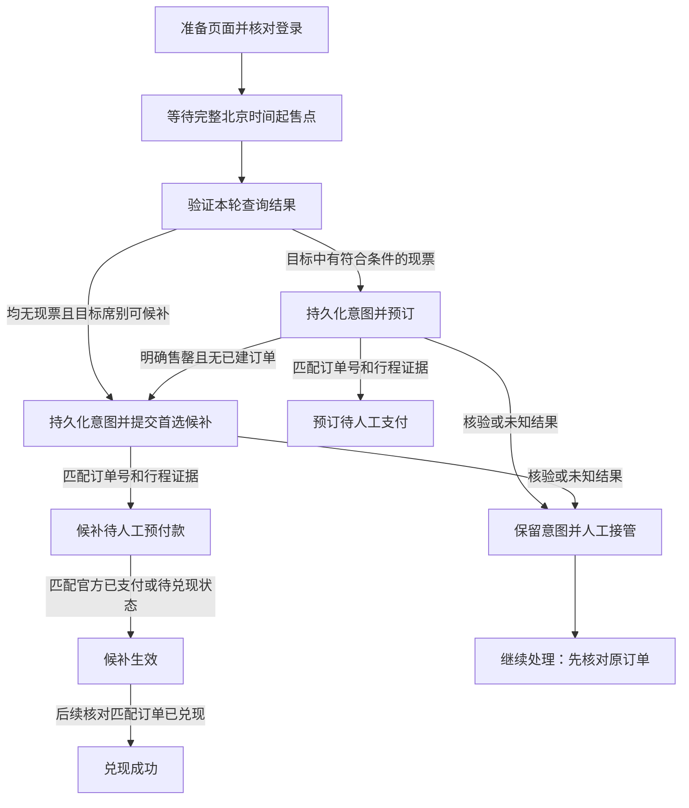

# RailWatch 交易可靠性实现与验收记录

日期：2026-09-08。适用范围：个人单账号、单个受控 Chrome，自动提交，人工核验及支付。当前仍为实验性辅助工具，未进行真实账号下单或付款验收。

## 已实现的行为

保留 Electron／React → JSON Lines → Python → Selenium Chrome。新增 `railwatch_order_page.py` 负责页面交易适配，`railwatch_orders.py` 负责交易结果与 SQLite 持久化。没有引入多工作进程抢票、非公开下单接口、验证码绕过或自动支付。



- 本轮先检查当前乘车日期下全部已配置车次的现票，按车次配置顺序、席别配置顺序选择。现票数量须足够配置乘客人数。没有现票才选择首选可候补席别，页面行顺序不会覆盖优先级。
- 自动化要求明确车次、席别和不重复的乘客姓名；不以“前几位乘客”或姓名子串代替精确匹配。
- 普通提交明确售罄后立即进入候补路径，不等待冲刺窗口或常规轮询间隔。必要时返回查询页重新获取可操作按钮，日期保持为原预订日期。此时导航及官方查询仍需要时间。
- 提交后超时、断连、未知弹窗不等于售罄。明确提交后售罄提示还需核对官方待支付列表为空，才允许候补回退。其他模糊提交即使看到空的待支付列表也不会自动解锁，以免已支付／处理中订单被遗漏。
- 成功证据必须来自官方 HTTPS 页面上的可见订单记录，包含订单号、正确订单种类、唯一匹配车次／日期／区间／席别及完整乘客名单。URL跳转、通用“成功”文字、按钮点击都不是订单证据。测试的本地页面入口需显式开启，生产默认关闭。
- 候补表单回读要求恰好一个目标组合，未添加其他组合、新增列车或无座设置；不匹配时停止提交。普通订单提交和确认、候补最终提交均只点击一次。
- 候补截止时间选择页面提供的现成选项，并回读确认。默认 `开车前60分钟`，可识别等价的 `开车前1小时`。旧 `18:00` 配置保留，只有官方页面提供对应日期与时刻时才接受，不伪造输入值或静默使用默认值。
- 候补“已支付／待兑现”与“已兑现”严格分开。待支付立即发送桌面／声音提醒；外部渠道在后台线程发送，不阻塞交易路径。不读取银行卡、不点击支付按钮。

## 持久化与恢复

数据文件为用户数据目录下 `orders.sqlite3`，包含配置快照、提交意图、订单证据及分阶段时间。该文件包含行程和乘客姓名，按本地账户数据管理，不应上传。没有保存付款凭据或完整页面快照。

1. 进入交易前先提交意图；SQLite唯一约束确保同一数据目录只有一个未解决意图。
2. 最终提交动作前先原子写入提交标记；恢复操作也需原子取得所有权。已有提交标记禁止自动重放，即使点击响应丢失或进程重启。
3. 重启只恢复待处理订单状态，不自动启动浏览器、不自动重新下单。点击“继续处理／核对订单”使用保存的行程，先识别当前页面和原订单。
4. 只有没有任何提交标记、页面仍为原订单表单且重新回读一致时，才可继续尚未提交的表单。提交过的任务只核对订单；需要用户在官网完成剩余核验／确认。
5. 已知订单号在登录失效或未知页面出现后继续保留。清空待支付列表不能抹掉已知订单。
6. 支付观察仅只读当前页面，每秒检查一次，不刷新或离开付款页面。连续30秒没有可识别订单证据时，提示完成支付后打开官方订单详情再继续处理。进入候补生效后停止本地轮询，官方队列继续运行；日后可再次点击核对兑现结果。
7. 待支付、结果未知、需核验和已生效候补仍持有本地订单锁，当前版本阻止启动新交易及清理本地数据。不会自动取消、重建候补。取消、过期、兑现失败和成功必须有匹配订单证据才释放锁。
8. 桌面单实例、防休眠锁和恢复事件保护同一浏览器任务。用户手动休眠或时钟跳变后暂停，要求重新检查。驱动传输超时35秒、页面和脚本另有超时；停止是协作取消，不能保证卡死的原生驱动立即退出。

## 起售调度与可观测性

配置版本提升至2，增加 `sale_at`、`sale_time_source`、`sale_time_checked_at`。`sale_at` 必须包含完整日期和 `+08:00`。旧 `target_time` 可继续保存，但启用定时需要在界面明确补全日期；不自动滚到次日。已经过去的完整起售时刻立即继续，不更改目标。

先启动浏览器、检查驱动、加载站码、填写查询条件并检查登录，再用系统时间锚定单调时钟等待。正常等待的最后10秒不导航、不联网校时、不探测登录。初始准备已经进入最后10秒或超过起售点时会记录警告，不算准点准备成功。等待中检测超过1秒的墙钟偏差或超过5秒的调度停顿并暂停。

HTTP `Date` 仅用于显式辅助检查，展示往返时间及秒级不确定度，不参与调度偏移。它不等同于售票调度服务器时钟，且估算误差不是可保证的上界。运行前仍需在操作系统中确认时间同步。

移除每五轮整页刷新和提交前鼠标动作、高亮、固定等待；未起售提示关闭后保留查询页。保留查询条件、页面身份、DOM版本及300毫秒稳定窗口：当前尚未找到经真实官方页面验证的更强完成信号，不能为缩短等待而接受旧表格或部分渲染结果。

`order_events` 同时保存墙钟、单调时间与以下阶段：

| 事件 | 含义 |
| --- | --- |
| `target_sale`、`prepared` | 目标起售时刻、准备完成时刻 |
| `scheduler_wake` | 本机定时器唤醒，附 `late_ms` |
| `query_click`、`query_result` | 查询点击前的时间标记、有效新结果 |
| `inventory_found`、`no_inventory` | 选定预订／候补分支 |
| `regular_submit` | 普通提交按钮点击前的持久化标记 |
| `confirmed_failure` | 售罄且已确认没有订单 |
| `alternate_first_action`、`alternate_submit` | 第一个候补页面动作、候补最终提交前 |
| `pending_payment`、`active`、`fulfilled` | 匹配订单待支付、候补生效、兑现／支付成功 |

页面动作标记紧邻调用但不是服务端接收时间；订单状态时间是本机观察时间，不代替官方生效时间。SQLite提交开销也包含在客户端关键路径中。

## 自动验证

```powershell
python -X utf8 -m unittest discover -s tests -p "test_*.py"
npm test
npm run build
python -X utf8 tests/browser_smoke.py
python -X utf8 tests/order_browser_smoke.py
python -X utf8 tests/timing_smoke.py --samples 1000
npm run build:runtime
python -X utf8 tests/runtime_order_smoke.py
```

Chrome测试使用独立临时profile、本地HTML，拦截 `*12306.cn*` 网络。覆盖未起售提示、空结果、旧结果、登录核验、错误组合／席别／乘客、截止时间失败、未知弹窗、重复点击防护、提交已接受但返回超时、支付前后状态。单元测试另覆盖SQLite重启恢复、跨连接互斥、恢复争用、持久化失败、售罄回退、时钟跳变和休眠暂停。

| 自动检查 | 结果 |
| --- | --- |
| Python单元测试 | 145通过 |
| Electron测试 | 30通过 |
| React测试 | 75通过 |
| 独立Chrome查询回归 | 10通过 |
| 独立Chrome订单回归 | 12通过 |
| TypeScript检查与生产构建 | 通过 |
| PyInstaller运行时构建及两次重启恢复冒烟 | 通过，未打开浏览器 |
| Git差异空白检查 | 通过 |

2026-09-08本机1000次定时演练（Python3.10.8，Windows10.0.26200，15毫秒短期限，无浏览器和网络）：

| 测量点 | P95 | P99 | 最大值 |
| --- | --- | --- | --- |
| 定时器唤醒误差 | 17.000ms | 17.000ms | 32.000ms |
| SQLite记录完成后返回误差 | 33.131ms | 36.568ms | 377.757ms |

原始汇总在忽略提交的 `build/qa/timing.json`。这组测试达到本地唤醒P95≤100ms、P99≤250ms的目标，只覆盖清醒机器上的短期限调度，不覆盖长期等待、高负载、休眠、官方页面或网络时延。首次候补动作P95≤500ms、桌面告警P95≤1s仍需端到端实测，不将单元测试耗时当作这些指标。

## 真实账号发布验收仍待完成

公开页面结构只能支持编写适配器；登录后的DOM、排队流程、弹窗和状态文本仍需人工验收。保守匹配可能将包含其他日期说明、姓名遮罩、多个相似记录的新布局识别为未知，此时保留页面与订单锁，不误报成功。

- 起售前确认站点起售时刻、系统校时、乘客实名状态及候补资格／额度；当前不承诺自动识别所有资格规则。
- 用有实际需求的单账号，先完成只读查询验收，核对全部车次、席别、日期和优先顺序。
- 人工观察普通提交、二次确认、售罄返回以及候补“选席别→清单→订单页→提交”的实际流程；保存脱敏DOM用于更新fixture。未识别弹窗必须停下。
- 核对页面实际支付期限与预付款金额，人工支付；回到官方订单详情验证待支付→生效→兑现状态。支付取消／超时、额度满、人脸、登录失效及限频提示均需验收。
- 在离线故障注入环境验证超时、进程退出、磁盘失败和重启；不要故意在真实付款交易中制造中断。
- 分别记录查询、订单创建、生效与人工支付耗时，核验零错误成功、零错误组合、零自动重复提交后再考虑发布。

截至本记录，未登录用户账号、未提交真实订单、未付款、未发布安装包。自动化测试不能替代上述验收，工具不能保证抢票或候补兑现。

## 规则与方案依据

- [12306候补常见问题](https://kyfw.12306.cn/otn/gonggao/alternate.html)：预付款后生效，按规则兑现。支付期限和截止选项以当时官方页面为准。
- [中国铁路2026-04官方答疑，政府网站转载](https://www.beijing.gov.cn/fuwu/bmfw/sy/jrts/202604/t20260430_4629701.html)：起售即候补及当前容量说明。
- [官方起售查询](https://www.12306.cn/index/view/infos/sale_time.html)：人工核对起售时刻与来源。
- [RFC9110 HTTP Date](https://www.rfc-editor.org/rfc/rfc9110.html#name-date)：消息产生时间，不是售票调度时钟契约。
- [Selenium等待机制](https://www.selenium.dev/documentation/webdriver/waits/)：用可取消条件等待处理动态页面。当前依赖固定为实际测试的Selenium4.44.0／requests2.33.1，要求Python3.10及以上；Chrome与ChromeDriver版本必须匹配。

没有采用尚无当前全国开放证据的官方自动提交试点，也不把换用Playwright或隐藏浏览器自动化特征视为排队优势。
